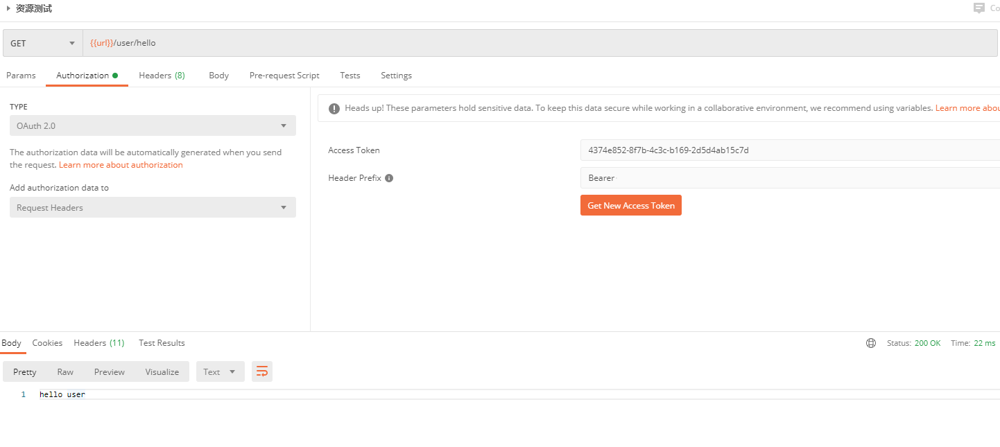

### 一、授权码模式

启动成功后，用这个地址进行授权访问：
[http://localhost:9000/oauth/authorize?client_id=client&response_type=code](http://localhost:9000/oauth/authorize?client_id=client&response_type=code)

到登录页面：
输入账号：admin  密码: 123456 登录

选择 Approve  点击 Authorize 认证

成功后的链接里的 code 就是授权码


打开postman用post方式获取access_token


这里的client就是代码里配置的client_id，secret就是代码里配置的secret，返回access_token

或者使用Basic Auth方式：


### 二、密码模式

打开postman用post方式获取access_token


获取资源




### 三、客户端模式

打开postman用post方式获取access_token


获取资源


### 四、简化模式

获取token

```url
http://localhost:9000/oauth/authorize?client_id=client_implicit&response_type=token
```

到登录页面：
输入账号：admin  密码: 123456 登录


选择 Approve  点击 Authorize 认证


获取资源

