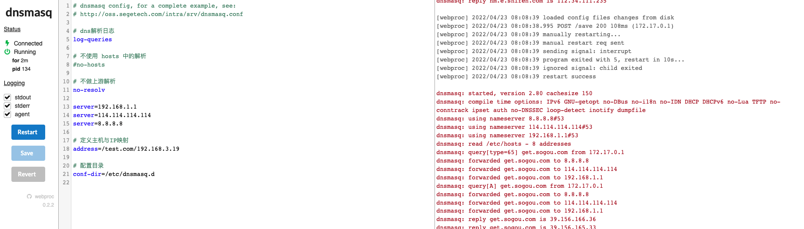

# Docker-Dnsmasq


dnsmasq in a docker container, configurable via a [simple web UI](https://github.com/jpillora/webproc)


## Usage

### 1、Build Dockerfile

```shell
docker build -t <your>/docker-dnsmasq:1.0 .
```


### 2、Create a `/opt/dnsmasq.conf` file on the Docker host

```conf
# dnsmasq config, for a complete example, see:
# http://oss.segetech.com/intra/srv/dnsmasq.conf

# dns解析日志
log-queries

# 不使用 hosts 中的解析
#no-hosts

# 不做上游解析
no-resolv

server=192.168.1.1
server=114.114.114.114
server=8.8.8.8

# 定义主机与IP映射
address=/test.com/192.168.3.19

# 配置目录
conf-dir=/etc/dnsmasq.d

```


### 3、Run the container

```shell
docker run --name dnsmasq -d -p 53:53/udp -p 5380:8080 -v /opt/dnsmasq.conf:/etc/dnsmasq.conf --log-opt "max-size=100m" -e "HTTP_USER=admin" -e "HTTP_PASS=admin" --restart always jpillora/dnsmasq
```


### 4、Visit `http://<docker-host>`:5380, authenticate with `admin/admin` and you should see




### 5、docker-compose.yml

```yaml
version: '3'
services:
  minio:
    image: jpillora/dnsmasq
    container_name: dns-server
    ports:
      - "53:53/udp"
      - "5380:8080"
    restart: always
    networks:
      mynetwork:
        aliases:
          - dns-server
    environment:
      TZ: Asia/Shanghai
      HTTP_USER: admin
      HTTP_PASS: admin
    volumes:
      - $PWD/dnsmasq.conf:/etc/dnsmasq.conf
networks:
  mynetwork:
    driver: bridge
```

