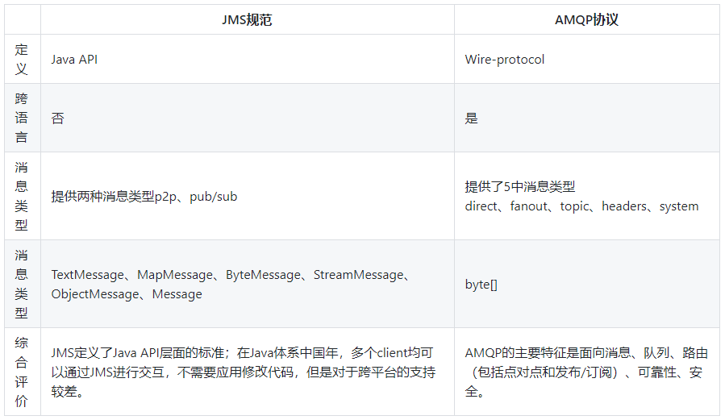
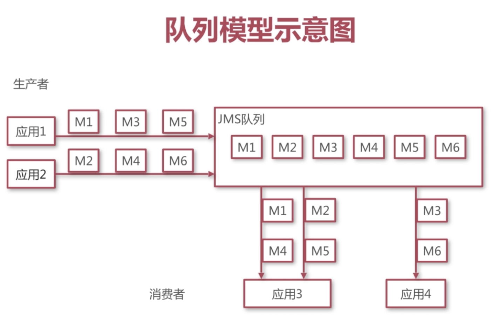
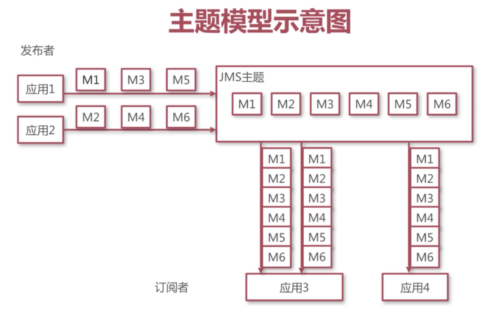

## 
Java消息中间件 - ActiveMQ

[TOC]

### 一、简介
#### 1.1 使用中间件带来的好处
* 系统解耦
* 异步
* 横向扩展
* 安全可靠（消息中间件会将我们的消息保存，直到我们的消息被消费为止。如果其他系统没有消费，或   消费系统出现异常的时候，消费系统可以在下一次恢复正常后继续消费这条消息。）
* 顺序保存

#### 1.2 消息中间件概述
1. **什么是中间件？**
> 非底层操作系统软件，非业务应用软件，不是直接给最终用户使用的，不能直接给客户带来价值的软件系统统称为中间件。
2. **什么是消息中间件？**
> 关注于数据的发送和接受，利用高效可靠的异步消息传递机制集成分布式系统。
3. **什么是JMS？**
> Java消息服务（Java Message Service）即JMS，是一个Java平台中关于面向消息中间件的API，用于在两个应用程序之间，或分布式系统中发送消息，进行异步通信。
4. **什么是AMQP？**
> AMQP（advanced message queuing protocol）是一个提供统一消息服务的应用层标准协议，基于此协议的客户端与消息中间件可传递消息，**并不受客户端/中间件不同产品，不同开发语言条件限制**。
5. **JMS与AMQP对比**
> 

#### 1.3 常见的消息中间件对比
1. **ActiveMQ**
ActiveMQ是Apache出品，最流行，能力强劲的开源消息总线。ActiveMQ是一个完全支持JMS1.1和J2EE1.4规范的JMS Provider实现，尽管JMS规范出台已经是很久的事情了，但是JMS在当今的J2EE应用中间件任然扮演着特殊的地位。
**ActiveMQ的特性：**
 * 多种语言和协议编写客户端
 * 支持语言：Java、C、C++、C#、Ruby、Perl、Python、PHP
 * 支持应用协议：OpenWire、Stomp REST、WS、Notification、XMPP、AMQP
 * 完全支持JMS1.1和J2EE1.4规范（持久化、XA消息、事务）
 * 虚拟主题、组合目的、镜像队列
2. **RabbitMQ**
RabbitMQ是一个开源的AMQP实现，服务端用Erlang语言编写。用于在分布式系统中存储转发消息，在易用性、扩展性、高可用性表现不俗。
**RabbitMQ的特性：**
 - 支持多种客户端，如：Java、Python、Ruby、.NET、JMS、C、PHP、ActionScript等
 - AMQP的完整实现（vhost、Exchange、Binding、Routing Key等）
 - 事务支持/发布确认
 - 消息持久化
3. **Kafka**
Kafka是一个高吞吐量的分布式发布订阅消息系统，是一个分布式的、分区的、可靠的分布式日志存储服务。它通过一种独一无二的设计提供了一个消息系统的功能。
**Kafka的特性：**
 + 通过O(1)的磁盘数据结构提供消息的持久化，这种结构对于即使数以TB的消息存储也能够保持长时间的稳定性能
 + 高吞吐量：即使是非常比普通的硬件Kafka也可以支持每秒数百万的消息
 + Partion、Consumer Group
4. **ActiveMQ、RabbitMQ和Kafka消息中间件对比**
|| ActiveMQ | RabbitMQ | Kafka |
|:--------|:--------:|:--------:|:--------:|
|  跨语言 |支持(Java优先)|语言无关|支持（Java优先）|
|支持协议|OpenWire,Stomp,XMPP,AMQP|AMQP||
|优点|遵循JMS规范安装部署方便|继承Erlang天生的并发性最初用于金融行业，稳定性，安全性有保障|依赖zk，可动态扩展节点，高性能，高吞吐量，无限扩容，消息可指定追溯|
|缺点|根据其他用户反馈，会莫名丢失消息。目前重心在下代产品apolle上，目前社区不活跃，对5.x维护较少|Erlang语言难度较大，不支持动态扩展|严格的顺序机制，不支持消息优先级，不支持标准的消息协议，不利于平台的迁移|
|综合评价|适合中小企业消息应用场景，不适合上千个队列的应用场景|适合对性能稳定性要求高的企业级应用|一般应用在大数据日志处理或者对实时性（少量延迟），可靠性（少量丢失数据）要求稍低的场景使用|

#### 1.4 JMS规范
1. **Java消息服务定义**
Java消息服务（Java Message Service）即JMS，是一个Java平台中关于面向消息中间件的API，用于在两个应用程序之间，或分布式系统中发送消息，进行**异步**通信。
2. **JMS相关概念**
**提供者：**实现JMS规范的消息中间件服务器
**客户端：**发送或接受消息的应用程序
**生产者/发布者：**创建并发送消息的客户端
**消费者/订阅者：**接受并处理消息的客户端
**消息：**应用程序之间传递的数据内容
**消息模式：**在客户端之间传递消息的方式，JMS定义了**主题**和**队列**两种模式
3. **队列模式**
 * 客户端包括生产者和消费者
 * 队列中的消息只能被一个消费者所消费
 * 消费者可以随时消费队列中的消息

 下图是队列模式示意图：
 
 应用1和应用2分别发送了消息M1/M3/M5 和M2/M4/M6共6条消息，然后消息队列中有了这6条消息，然后创建了2个消费者应用3建立了2个连接和应用4建立了一个连接，由结果可见，应用消费者中的每个连接平摊了队列中的每个消息。

4. **主题模式**
 * 客户端包括发布者可订阅者
 * 主题中的消息被所有订阅者消费
 * 消费者不能消费订阅之前就发送到主题中的消息

 下图是主题模式示意图：
 
 创建两个订阅者应用3和应用4与JMS主题先建立连接，然后再创建两个发布者应用1和应用2与JMS主题建立连接分别发送了M1/M3/M5和M2/M4/M6，这时JMS主题中有了6条消息，由于应用3和应用4在之前就订阅了该主题的消息，所以应用3和应用4都能收到所有的消息。主要是订阅者需要提前去订阅主题。

### 二、安装ActiveMQ
#### 2.1 Windows平台安装ActiveMQ
1. 下载安装包 http://www.apache.org/dyn/closer.cgi?filename=/activemq/5.15.4/apache-activemq-5.15.4-bin.zip&action=download
2. 直接启动
解压安装包后进入bin/win64目录，运行activemq.bat即运行activeMQ
3. 使用服务启动
解压安装包后进入bin/win64目录，运行installService.bat,运行之后，会将ActiveMQ以服务的方式安装到我们电脑，这样我们就可以以服务的方式启动了。

#### 2.2 Linux平台安装ActiveMQ
> #下载安装包

> wget http://www.apache.org/dyn/closer.cgi?filename=/activemq/5.15.4/apache-activemq-5.15.4-bin.tar.gz&action=download

> #解压安装包

> tar -xzvf apache-activemq-5.15.4.tar.gz

> ln -s apache-activemq-5.15.4 apache-activemq

> cd apache-activemq/bin

> #启动ActiveMQ

> ./activemq start

> #停止ActiveMQ

> ./activemq stop

访问：http://127.0.0.1:8681
然后点击Manage ActiveMQ broker 会要求输入ActiveMQ管理密码，默认是admin/admin
#### 2.3 ActiveMQ配置文件相关
1. [ActiveMQ主要配置文件](https://www.cnblogs.com/qq-361807535/p/6684196.html)
2. [ActiveMQ目录配置文件](http://donald-draper.iteye.com/blog/2347805)

### 三、ActiveMQ集群