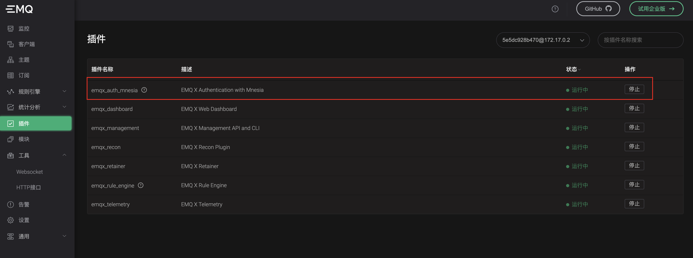

# 物联网消息引擎：EMQ X

## 一、MQTT协议与EMQX

### 1. MQTT协议简介

MQTT官网：[http://mqtt.org](http://mqtt.org)

MQTT中文网：[http://mqtt.p2hp.com/](http://mqtt.p2hp.com/)

#### 1.1 MQTT简介

MQTT（Message Queuing Telemetry Transport，消息队列遥测传输协议），是一种基于发布/订阅
（publish/subscribe）模式的"轻量级"通讯协议，该协议构建于TCP/IP协议上，由IBM在1999年发布。MQTT最大优点在于，可以以极少的代码和有限的带宽，为连接远程设备提供实时可靠的消息服务。作为一种低开销、低带宽占用的即时通讯协议，使其在物联网、小型设备、移动应用等方面有较广泛的应用。

MQTT是一个基于客户端-服务器的消息发布/订阅传输协议。MQTT协议是轻量、简单、开放和易于实现的，这些特点使它适用范围非常广泛。在很多情况下，包括受限的环境中，如：机器与机器（M2M）通信和物联网（IoT）。其在，通过卫星链路通信传感器、偶尔拨号的医疗设备、智能家居、及一些小型化设备中已广泛使用。


### 2. EMQX简介

EMQ官网：[https://www.emqx.io/zh](https://www.emqx.io/zh)

EMQX是基于Erlang/OPT平台开发的MQTT消息服务器，是开源社区中最流行的MQTT消息服务器

#### 2.1 MQTT Broker种类

目前为止，比较流行的MQTT Broker有几个：

- Eclipse Mosquitto: https://github.com/eclipse/mosquitto 

  使用 C 语言实现的 MQTT Broker。Eclipse 组织还还包含了大量的 MQTT 客户端项目：

  https://www.eclipse.org/paho/#

- EMQX: https://github.com/emqx/emqx

  使用 Erlang 语言开发的 MQTT Broker，支持许多其他 IoT 协议比如 CoAP、LwM2M 等 

- Mosca: https://github.com/mcollina/mosca

  使用 Node.JS 开发的 MQTT Broker，简单易用

- VerneMQ: https://github.com/vernemq/vernemq

  同样使用 Erlang 开发的 MQTT Broker

#### 2.2 EMQX安装

安装包下载地址：[https://www.emqx.io/zh/downloads#broker](https://www.emqx.io/zh/downloads#broker)

Docker方式安装：

```shell
> docker pull emqx/emqx:4.4.2

> docker run -d --name emqx -p 1883:1883 -p 8081:8081 -p 8083:8083 -p 8084:8084 -p 8883:8883 -p 18083:18083 emqx/emqx:4.4.2
```


## 二、EMQX基础

### 1. 认证

#### 1.1 mnesia 认证

mnesia 认证 包含 username 认证 和 Client ID 认证，使用配置文件预设 或 通过HTTP API管理认证数据

启用插件 `emqx_auth_mnesia`



**哈希方法**

mnesia 认证默认使用 sha256 进行密码哈希加密，可在 `etc/plugins/emqx_auth_mnesia.conf`中更改

```shell
bash-5.1$ cat emqx_auth_mnesia.conf
## Password hash.
##
## Value: plain | md5 | sha | sha256 | sha512
auth.mnesia.password_hash = sha256
```

HTTP API 接口参考 `Dashboard 工具/HTTP接口`

```http
-- 查看已有用户
GET http://127.0.0.1:18083/api/v4/auth_username
Accept: */*
Content-Type: application/json
Authorization: Basic YWRtaW46cHVibGlj

-- 新增用户
POST http://127.0.0.1:18083/api/v4/auth_username
Accept: */*
Content-Type: application/json
Authorization: Basic YWRtaW46cHVibGlj

{
  "username": "user",
  "password": "123456"
}

-- 查看已有ClientId
GET http://127.0.0.1:18083/api/v4/auth_clientid
Accept: */*
Content-Type: application/json
Authorization: Basic YWRtaW46cHVibGlj

-- 新增ClientId
POST http://127.0.0.1:18083/api/v4/auth_clientid
Accept: */*
Content-Type: application/json
Authorization: Basic YWRtaW46cHVibGlj

{
  "clientid": "emqx-client1",
  "password": "123456"
}

```


#### 1.2 HTTP认证

自行开发认证服务器，参考 [emqx](../../code/emqx)


### 2. 客户端SDK

#### 2.1 Eclipse Paho Java Client 使用

[Eclipse Paho Java Client](https://www.eclipse.org/paho/clients/java/)是用 Java 编写的 MQTT 客户端库（MQTT Java Client），可用于 JVM 或其他 Java 兼容平台（例如Android）。

Eclipse Paho Java Client 提供了MqttAsyncClient 和 MqttClient 异步和同步 API。

**通过 Maven 安装 Paho Java**

通过包管理工具 Maven 可以方便地安装 Paho Java 客户端库，截止目前最新版本安装如下：

```xml
<dependency>
  <groupId>org.eclipse.paho</groupId>
	<artifactId>org.eclipse.paho.client.mqttv3</artifactId>
	<version>1.2.5</version>
</dependency>
```

代码参考 [emqx](../../code/emqx)
