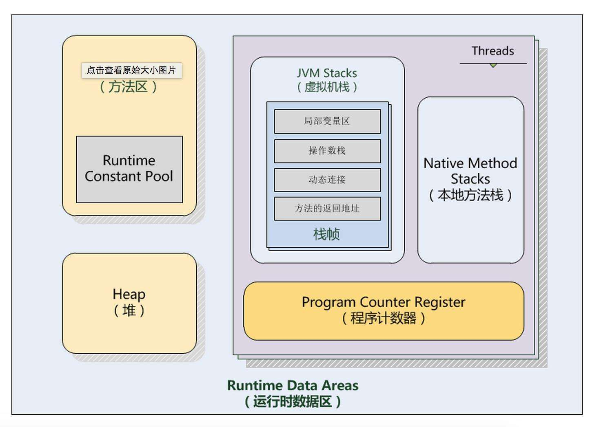

## jvm内存模型

### 一、CUP和内存

CPU中，每个CPU有多级缓存（定义为高速缓存），一般分为L1，L2，L3，因为这些缓存的出现，提高了数据访问性能，避免每次都向内存索取，但是弊端也很明显，不能实时的和内存发生信息交换，在不同CPU执行的不同线程对同一个变量的缓存值不同。

硬件层的内存屏障分为两种：Load Barrier 和 Store Barrier 即读屏障和写屏障。

1. **为什么需要内存屏障？**

   由于现代操作系统都是多处理器操作系统，每个处理器都会有自己的缓存，可能存在不同处理器缓存不一致的问题，而且由于操作系统可能存在重排序，导致读取到错误的数据，因此，操作系统提供了一些内存屏障以解决这种问题。

   简单来说：

   * 在不同CPU执行的不同线程对同一个变量的缓存值不同。
   * 用volatile可以解决上面的问题，不同硬件对内存屏障的实现方式不一样。java屏蔽掉这些差异，通过jvm生成内存屏障的指令。
     对于读屏障：在指令前插入读屏障，可以让高速缓存中的数据失效，强制从主内存取。

2. **内存屏障的作用**

   cpu执行指令可能是无序的，它有两个比较重要的作用：

   * 阻止屏障两侧指令重排序
   * 强制把写缓冲区/高速缓存中的脏数据等写回主内存，让缓存中相应的数据失效

3. **volatile变量**

   当我们声明某个变量为volatile修饰时，这个变量就有了线程可见性，volatil修饰时，会在读写操作前后添加内存屏障。

   volatile型变量拥有如下特性：

   * 可见性，对于一个该变量的读，一定能看到读之前最后的写入，即读的值一定是内存中最新的
   * 原子性，对volatile变量的读写具有原子性，即单纯读和写的操作，都不会受到干扰

### 二、jvm内存模型

Java程序内存的分配是在JVM虚拟机内存分配机制下完成的。

Java内存模型（Java Memory Model ,JMM）就是一种符合内存模型规范的，屏蔽了各种硬件和操作系统的访问差异的，保证了Java程序在各种平台下对内存的访问都能保证效果一致的机制及规范。

> 简要言之，jmm是jvm的一种规范，定义了jvm的内存模型。它屏蔽了各种硬件和操作系统的访问差异，不像C那样直接访问硬件内存，相对安全很多，它的主要目的是解决由于多线程通过共享内存进行通信时，存在的本地内存数据不一致、编译器会对代码指令重排序、处理器会对代码乱序执行等带来的问题。可以保证并发编程场景中的原子性、可见性和有序性。
>

根据java虚拟机规范，java虚拟机管理的内存将分为下面五大区域。

**其中方法区和堆是所有线程共享的；虚拟机栈、本地方法栈和程序计数器是线程私有的。**

1. **程序计数器**

   程序计数器是一块很小的内存空间，它是线程私有的，可以认作为当前线程的行号指示器。

   > 对于一个处理器(如果是多核cpu那就是一核)，在一个确定的时刻都只会执行一条线程中的指令，一条线程中有多个指令，为了线程切换可以恢复到正确执行位置，每个线程都需有独立的一个程序计数器，不同线程之间的程序计数器互不影响，独立存储。
   >
   > 注意：如果线程执行的是个java方法，那么计数器记录虚拟机字节码指令的地址。如果为native【底层方法】，那么计数器为空。**这块内存区域是虚拟机规范中唯一没有OutOfMemoryError的区域**。

2. **虚拟机栈**

   和程序计数器一样也是线程私有的，生命周期与之相同，就是我们平时说的栈，**栈描述的是Java方法执行的内存模型**。

   每个方法被执行的时候都会创建一个栈帧用于存储**局部变量表**，操作栈，动态链接，方法出口等信息。每一个方法被调用的过程就对应一个栈帧在虚拟机栈中从入栈到出栈的过程。

   **我们平时说的栈一般指局部变量表部分：**

   > 局部变量表：一片连续的内存空间，用来存放方法参数、方法内定义的局部变量以及编译期间已知的数据类型（八大基本类型和对象引用（reference类型））,returnAddress类型。它的最小的局部变量表空间单位为Slot，虚拟机没有指明Slot的大小，但在jvm中，long和double类型数据明确规定为64位，这两个类型占2个Slot，其它基本类型固定占用1个Slot。
   >
   > reference类型：与基本类型不同的是它不等同本身，即使是String，内部也是char数组组成，它可能是指向一个对象起始位置指针，也可能指向一个代表对象的句柄或其他与该对象有关的位置。
   >
   > returnAddress类型：指向一条字节码指令的地址。

   **注意：**局部变量表所需要的内存空间在编译期完成分配，当进入一个方法时，这个方法在栈中需要分配多大的局部变量空间是完全确定的，在方法运行期间不会改变局部变量表大小。

   > Java虚拟机栈可能出现两种类型的异常：
   >
   > * 线程请求的栈深度大于虚拟机允许的栈深度，将抛出StackOverflowError
   > * 虚拟机栈空间可以动态扩展，当动态扩展时无法申请到足够的空间时，抛出OutOfMemory异常

3. **本地方法栈**

   本地方法栈与虚拟机栈发挥的作用十分相似，区别是虚拟机栈执行的是Java方法(也就是字节码)服务，而本地方法栈则为虚拟机使用到的native方法服务，可能底层调用的c或者c++，我们打开jdk安装目录可以看到也有很多用c编写的文件，可能就是native方法所调用的c代码。

4. **堆**

   对于大多数应用来说，**堆是java虚拟机管理内存最大的一块内存区域，因为堆存放的对象是线程共享的，所以使用多线程的时候也需要同步机制**。

   java虚拟机规范对这块的描述是：所有对象实例及数组都要在堆上分配内存，但随着JIT编译器的发展和逃逸分析技术的成熟，这个说法也不是那么绝对，但是大多数情况都是这样的。

   > 注意：堆是所有线程共享的，它的目的是存放对象实例。同时它也是GC所管理的主要区域，因此常被称为GC堆，又由于现在收集器常使用分代算法，Java堆中还可以细分为新生代和老年代，再细致点还有Eden空间之类的。
   >
   > 根据虚拟机规范，Java堆可以存在物理上不连续的内存空间，就像磁盘空间只要逻辑是连续的即可。它的内存大小可以设为固定大小，也可以扩展。
   >
   > 当前主流的虚拟机如HotPot都能按扩展实现(通过设置 -Xmx和-Xms)，如果堆中没有内存内存完成实例分配，而且堆无法扩展将报OOM错误(OutOfMemoryError)

5. **方法区**

   方法区同堆一样，是所有线程共享的内存区域，为了区分堆，又被称为非堆。

   用于存储已被虚拟机加载的类信息、常量、静态变量，如：static修饰的变量在加载类的时候就被加载到方法区中。

   > 运行时常量池
   >
   > 是方法区的一部分，class文件除了有类的字段、接口、方法等描述信息之外，还有常量池用于存放编译期间生成的各种字面量和符号引用。
   >
   > 从jdk7之后，Hotspot虚拟机将运行时常量池从永久代中移除了

   在老板的jdk中，方法区也被称为永久代。jdk8真正开始废弃永久代，而使用元空间（Metaspace）