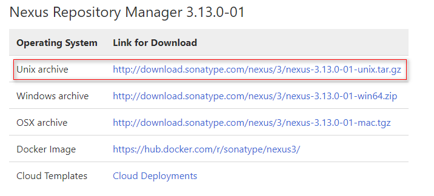
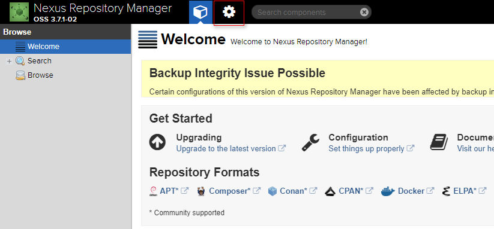
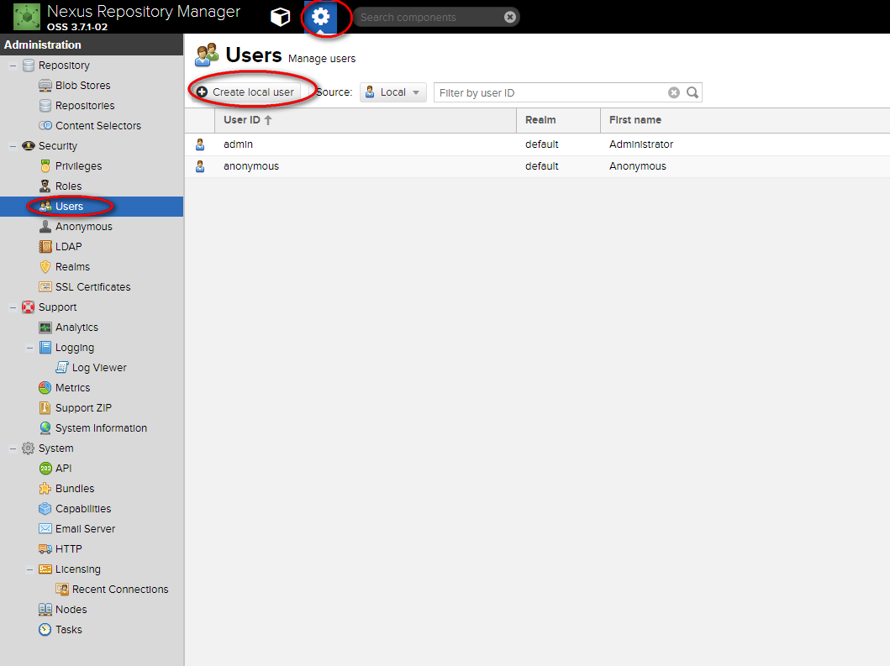
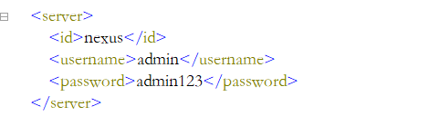
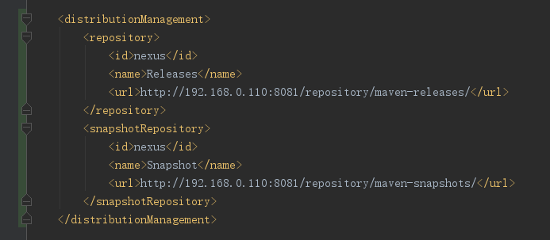

## 
maven部署jar到私服

### 一、nexus安装
1. 下载地址：https://help.sonatype.com/repomanager3/download/download-archives---repository-manager-3

2. 下载后解压，然后启动，默认开放 8081 端口
> 启动命令：/home/luoc/nexus3/nexus-3.13.0-01/bin/nexus run &

### 二、使用
1. 安装成功后有两个默认账号 admin、anonymous，其中admin具有全部权限，默认密码 admin123；anonymous作为匿名用户，只具有查看权限。

2. 点击如下图标，在“设置”里可以添加用户、角色，对接LDAP等的设置

3. component name 说明
 1) maven-central：maven中央仓库，默认从https://repo1.maven.org/maven2/拉取jar
 2) maven-releases：私库发行版jar
 3) maven-snapshots：私库快照版（调试版本）jar
 4) maven-public：仓库分组，把上面三个仓库组合在一起对外提供服务，在本地maven基础配置settings.xml中使用

4. nexus默认的仓库类型有以下四种
 1) group(仓库组类型)：又叫组仓库，用于方便开发人员自己设定的仓库
 2) hosted(宿主类型)：内部项目的发布仓库（内部开发人员，发布上去存放的仓库）
 3) proxy(代理类型)：从远程中央仓库中寻找数据的仓库（可以点击对应的仓库的Configuration页签下Remote Storage Location属性的值即被代理的远程仓库的路径）
 4) virtual(虚拟类型)：虚拟仓库（这个基本用不到，重点关注上面三个仓库的使用）

### 三、jar发布到私服
1. 本地maven库配置setting.xml

2. 工程pom文件配置

**注意事项**
pom文件中的repository中的 id 要与 setting.xml 中的server的 id 一致

3. 使用 mvn clean deploy 命令运行即可上传到私服