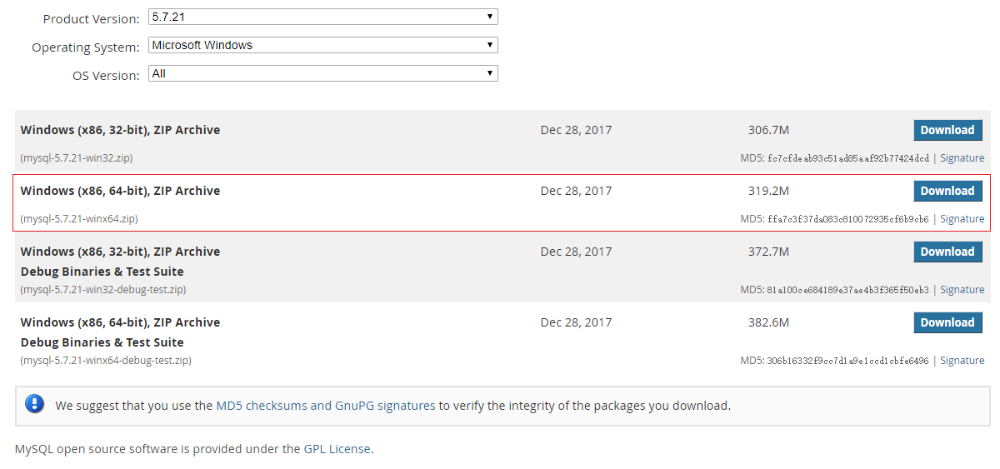
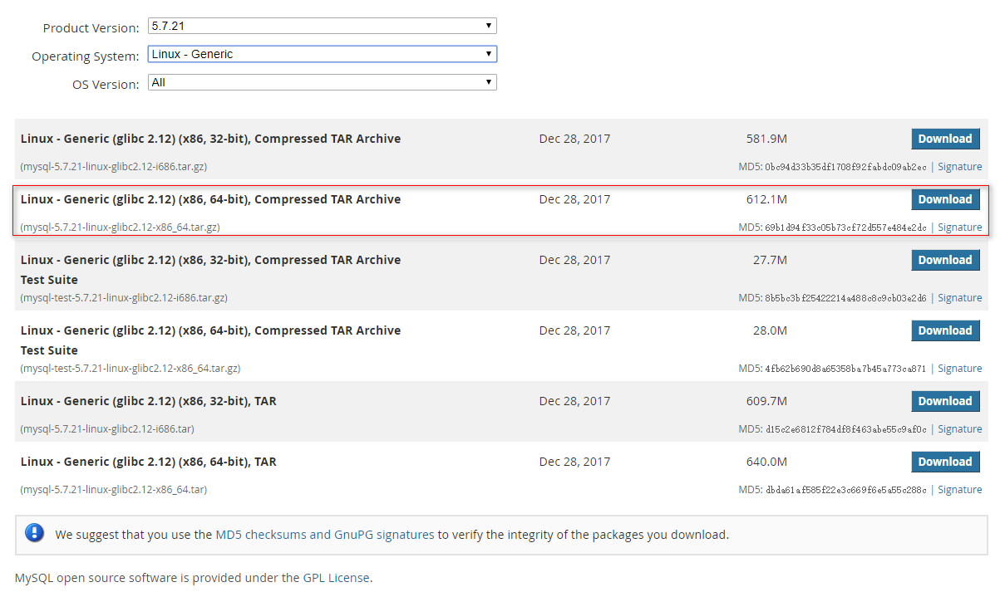

## <center>MySQL学习笔记</center>
### 一、MySQL安装
#### 1.1 Windows平台安装MySQL
##### 1.1.1 下载MySQL安装包
[MySQL Community Server（Archived Versions）](https://downloads.mysql.com/archives/community/)


##### 1.1.2 安装
ZIP Archive版是免安装的。只要解压就行了。不需要安装。我的放在C盘。

##### 1.1.3 配置
把my-default.ini（此文件是解压之后，自带的）这个文件复制一下，重命名为my.ini，然后如下配置：

##### 1.1.4 安装MySQL服务并启动
以管理员身份打开CMD窗口后，将目录切换到解压的mysql目录下的bin目录

输入 mysqld install

输入 mysqld --initialize-insecure --user=mysql
（执行完上面命令后，MySQL会自建一个data文件夹，并且建好默认数据库，登录的用户名为root，密码为空）

输入 net start mysql 启动服务

##### 1.1.5 移除MySQL服务
以管理员身份打开CMD窗口后，将目录切换到解压的mysql目录下的bin目录

输入 mysqld -remove
#### 1.2 Linux平台安装MySQL
##### 1.2.1 下载MySQL安装包
[MySQL Community Server（Archived Versions）](https://downloads.mysql.com/archives/community/)



#下载

wget https://downloads.mysql.com/archives/get/file/mysql-5.7.21-linux-glibc2.12-x86_64.tar.gz

#解压和移动目录

tar -xzvf mysql-5.7.21-linux-glibc2.12-x86_64.tar.gz

cd mysql-5.7.21-linux-glibc2.12-x86_64

sudo cp -r . /usr/local/mysql

#添加mysql组和用户

sudo groupadd mysql

sudo useradd -r -g mysql -s /bin/false mysql

#进入安装MySQL软件的目录，并修改目录的拥有者为mysql用户

cd /usr/local/mysql

sudo chown -R mysql:mysql .

#安装MySQL

sudo ./bin/mysqld --initialize-insecure --user=mysql --basedir=/usr/local/mysql/ --datadir=/usr/local/mysql/data/

sudo vim /etc/my.cnf 将如下内容复制进去


#开启MySQL服务

./support-files/mysql.server start

#将MySQL进程放入系统进程中

cp support-files/mysql.server /etc/init.d/mysqld

#重新启动MySQL服务

systemctl start mysql

#配置MySQL系统变量

vim /etc/profile

```
#MySQL
MYSQLHOME=/usr/local/mysql
PATH=$PATH:$MYSQLHOME/bin
export MYSQLHOME PATH
```

#使配置生效

source /etc/profile

#使用随机密码登录mysql数据库，命令如下：

mysql -u root –p

等待系统提示，输入随机密码，即可登录

#进入mysql操作行，为root用户设置新密码（这里设为root）：

alter user 'root'@'localhost' identified by 'root';

#设置允许远程连接数据库，命令如下：

```
MySQL 8.0.x之前的授权方式（5.6或者5.7都支持这种方式授权）
mysql> grant all privileges on *.* to 'root'@'%' identified by 'root' with grant option;
```

#刷新权限，命令如下：

flush privileges;

#将mysqld服务加入chkconfig列表中：

chkconfig –add mysqld

#设置mysqld服务开机自动启动：

chkconfig mysqld on

#添加my.cnf配置文件

上传my-default.ini文件到/usr/local/mysql/support-files下（MySQL 5.7.19版改目录下已经没有my-default.ini文件）

cp my-default.ini /etc/my.cnf


#### 1.3 CentOS 7.x安装MySQL 8.0.28（2022.09.12最新）

##### 1.3.1 下载MySQL安装包

[https://downloads.mysql.com/archives/get/p/23/file/mysql-8.0.28-linux-glibc2.12-x86_64.tar.xz](https://downloads.mysql.com/archives/get/p/23/file/mysql-8.0.28-linux-glibc2.12-x86_64.tar.xz)


```shell
# 本机
> scp mysql-8.0.28-linux-glibc2.12-x86_64.tar.xz admin@192.168.3.33:/home/admin/software/mysql-8.0.28-linux-glibc2.12-x86_64.tar.xz
> scp my.cnf admin@192.168.3.33:/home/admin/software

# 192.168.3.33 服务器
> su - root
> cd /home/admin/software
> tar -xvf mysql-8.0.28-linux-glibc2.12-x86_64.tar.xz -C /usr/local
> cp my.cnf /etc/my.cnf
> groupadd mysql
> useradd -r -g mysql -s /bin/false mysql
> cd /usr/local/
> ln -s /usr/local/mysql-8.0.28-linux-glibc2.12-x86_64 mysql
> cd mysql
> mkdir log data
> cd ..
> chown -R mysql:mysql mysql mysql-8.0.28-linux-glibc2.12-x86_64
> cd mysql
# 初始化数据库，第一种方式
> ./bin/mysqld --defaults-file=/etc/my.cnf --initialize-insecure --user=mysql --basedir=/usr/local/mysql --datadir=/usr/local/mysql/data
2022-09-12T09:41:07.622539Z 0 [Warning] [MY-011070] [Server] 'Disabling symbolic links using --skip-symbolic-links (or equivalent) is the default. Consider not using this option as it' is deprecated and will be removed in a future release.
2022-09-12T09:41:07.622628Z 0 [System] [MY-013169] [Server] /usr/local/mysql-8.0.28-linux-glibc2.12-x86_64/bin/mysqld (mysqld 8.0.28) initializing of server in progress as process 9946
2022-09-12T09:41:07.635529Z 1 [System] [MY-013576] [InnoDB] InnoDB initialization has started.
2022-09-12T09:41:08.456332Z 1 [System] [MY-013577] [InnoDB] InnoDB initialization has ended.
2022-09-12T09:41:09.881925Z 6 [Warning] [MY-010453] [Server] root@localhost is created with an empty password ! Please consider switching off the --initialize-insecure option. -- root是空密码

# 初始化数据库，第二种方式
> ./bin/mysqld --defaults-file=/etc/my.cnf --initialize --user=mysql --basedir=/usr/local/mysql --datadir=/usr/local/mysql/data
2022-09-12T10:01:39.026662Z 0 [System] [MY-013169] [Server] /usr/local/mysql-8.0.28-linux-glibc2.12-x86_64/bin/mysqld (mysqld 8.0.28) initializing of server in progress as process 10110
2022-09-12T10:01:39.036553Z 1 [System] [MY-013576] [InnoDB] InnoDB initialization has started.
2022-09-12T10:01:39.908474Z 1 [System] [MY-013577] [InnoDB] InnoDB initialization has ended.
2022-09-12T10:01:41.044329Z 6 [Note] [MY-010454] [Server] A temporary password is generated for root@localhost: CarWnA,>y90l -- root密码是: CarWnA,>y90l

> cp support-files/mysql.server /etc/init.d/mysqld --将MySQL进程放入系统进程中
> systemctl start mysql 或者 service mysqld start
> vim /etc/profile
# MySQL
MYSQL_HOME=/usr/local/mysql
PATH=$PATH:$MYSQL_HOME/bin
export MYSQLHOME PATH
> source /etc/profile
> mysql -u root -p 
Enter password: CarWnA,>y90l

mysql> alter user 'root'@'localhost' identified with mysql_native_password by 'root'; --修改root@localhost的密码
Query OK, 0 rows affected (0.01 sec)

```


**MySQL 8.0.x授权方式，记得使用flush privileges刷新权限**

```shell
mysql> create user 'root'@'%' identified by 'root'; --第一步创建用户
Query OK, 0 rows affected (0.02 sec)

mysql> grant all on *.* to root@'%'; --第二步授权
Query OK, 0 rows affected (0.01 sec)

mysql> alter user 'root'@'%' identified with mysql_native_password by 'root'; --第三步修改密码验证方式
Query OK, 0 rows affected (0.00 sec)

mysql> flush privileges; --第四步刷新权限
Query OK, 0 rows affected (0.01 sec)
```


**重新初始化MySQL数据库**

```shell
> cd /usr/local/mysql
> rm -rf log data
> mkdir log data
> cd ..
> chown -R mysql:mysql mysql mysql-8.0.28-linux-glibc2.12-x86_64
> cd mysql
> ... 按以上步骤初始化MySQL数据库
```


#### 1.4 MySQL主从复制

##### 1.4.1 主库配置

服务器: 192.168.3.31

```shell
> vim /etc/my.cnf   --修改my.cnf, 在打开的文件中加入下面两行，其中的server-id不一定是1，确保唯一即可
[mysqld]
log-bin=mysql-bin   #[必须]启用二进制日志
server-id=1         #[必须]服务器唯一ID
> systemctl restart mysql  --重启MySQL服务
> mysql -u root -p         --登录主库mysql服务

mysql> create user 'rootslave'@'%' identified with mysql_native_password by 'rootslave'; --创建用于从库复制的用户
mysql> grant replication slave on *.* to 'rootslave'@'%'; --授权
mysql> flush privileges; --刷新权限
mysql> show master status; --查看master同步状态，执行完这条SQL后，不要再操作主库!!!
+------------------+----------+--------------+------------------+-------------------+
| File             | Position | Binlog_Do_DB | Binlog_Ignore_DB | Executed_Gtid_Set |
+------------------+----------+--------------+------------------+-------------------+
| mysql-bin.000002 |     2106 |              |                  |                   |
+------------------+----------+--------------+------------------+-------------------+
1 row in set (0.00 sec)

```


##### 1.4.2 从库配置

服务器: 192.168.3.33

```shell
> vim /etc/my.cnf   --修改my.cnf, server-id不一定是2，确保唯一即可，即不能和主库及其他从库相同
[mysqld]
server-id=2         #[必须]服务器唯一ID
> systemctl restart mysql  --重启MySQL服务
> mysql -u root -p         --登录从库mysql服务

mysql> change master to master_host='192.168.3.31',master_user='rootslave',master_password='rootslave',master_log_file='mysql-bin.000002',master_log_pos=2106; --在slave从库上设置连接主库的参数
参数说明：
master_host: 主库的 IP地址
master_user: 访问主库进行主从复制的 用户名 ( 上面在主库创建的 )
master_password: 访问主库进行主从复制的用户名对应的 密码
master_log_file: 从哪个 日志文件 开始同步 ( 即1.4.1中获取的 File )
master_log_pos: 从指定日志文件的哪个 位置 开始同步 ( 即1.4.1中获取的 Position )

mysql> start slave; --启动slave复制
其他命令:
reset slave 重置从库
stop slave  停止从库

mysql> show slave status\G;  --查看从库状态
*************************** 1. row ***************************
               Slave_IO_State: Waiting for source to send event
                  Master_Host: 192.168.3.31
                  Master_User: rootslave
                  Master_Port: 3306
                Connect_Retry: 60
              Master_Log_File: mysql-bin.000002
          Read_Master_Log_Pos: 2106
               Relay_Log_File: localhost-relay-bin.000002
                Relay_Log_Pos: 326
        Relay_Master_Log_File: mysql-bin.000002
             Slave_IO_Running: Yes
            Slave_SQL_Running: Yes
              Replicate_Do_DB:
          Replicate_Ignore_DB:
           Replicate_Do_Table:
       Replicate_Ignore_Table:
      Replicate_Wild_Do_Table:
  Replicate_Wild_Ignore_Table:
                   Last_Errno: 0
                   Last_Error:
                 Skip_Counter: 0
          Exec_Master_Log_Pos: 2106
              Relay_Log_Space: 540
              Until_Condition: None
               Until_Log_File:
                Until_Log_Pos: 0
           Master_SSL_Allowed: No
           Master_SSL_CA_File:
           Master_SSL_CA_Path:
              Master_SSL_Cert:
            Master_SSL_Cipher:
               Master_SSL_Key:
        Seconds_Behind_Master: 0
Master_SSL_Verify_Server_Cert: No
                Last_IO_Errno: 0
                Last_IO_Error:
               Last_SQL_Errno: 0
               Last_SQL_Error:
  Replicate_Ignore_Server_Ids:
             Master_Server_Id: 1
                  Master_UUID: 53707562-3284-11ed-878c-000c29041daa
             Master_Info_File: mysql.slave_master_info
                    SQL_Delay: 0
          SQL_Remaining_Delay: NULL
      Slave_SQL_Running_State: Replica has read all relay log; waiting for more updates
           Master_Retry_Count: 86400
                  Master_Bind:
      Last_IO_Error_Timestamp:
     Last_SQL_Error_Timestamp:
               Master_SSL_Crl:
           Master_SSL_Crlpath:
           Retrieved_Gtid_Set:
            Executed_Gtid_Set:
                Auto_Position: 0
         Replicate_Rewrite_DB:
                 Channel_Name:
           Master_TLS_Version:
       Master_public_key_path:
        Get_master_public_key: 0
            Network_Namespace:
1 row in set, 1 warning (0.00 sec)

通过状态信息中的 Slave_IO_running 和 Slave_SQL_running 可以看出主从同步是否就绪，如果这两个参数全为 Yes ，表示主从同步已经配置完成
```


##### 1.4.3 主从复制测试

```shell
① 在主库中创建一张表
mysql> create database if not exists test_db default character set utf8mb4 default collate utf8mb4_general_ci;
Query OK, 1 row affected (0.01 sec)
mysql> use test_db;
Database changed
mysql> create table t1(id int not null);
Query OK, 0 rows affected (0.01 sec)

② 在从库中查看
mysql> show databases;
+--------------------+
| Database           |
+--------------------+
| information_schema |
| mysql              |
| performance_schema |
| sys                |
| test_db            |
+--------------------+
5 rows in set (0.00 sec)

mysql> use test_db;
Database changed
mysql> show tables;
+-------------------+
| Tables_in_test_db |
+-------------------+
| t1                |
+-------------------+
1 row in set (0.00 sec)
```

