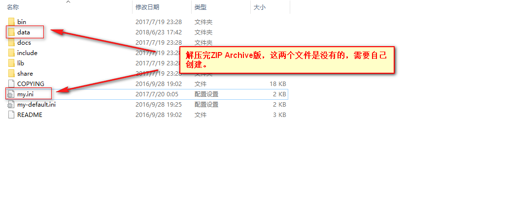

## <center>MySQL学习笔记</center>
### 一、MySQL安装
#### 1.1 Windows平台安装MySQL
##### 1.1.1 下载MySQL安装包
[MySQL Community Server（Archived Versions）](https://downloads.mysql.com/archives/community/)


##### 1.1.2 安装
ZIP Archive版是免安装的。只要解压就行了。不需要安装。我的放在C盘。

##### 1.1.3 配置
把my-default.ini（此文件是解压之后，自带的）这个文件复制一下，重命名为my.ini，然后如下配置：

##### 1.1.4 安装MySQL服务并启动
以管理员身份打开CMD窗口后，将目录切换到解压的mysql目录下的bin目录

输入 mysqld install

输入 mysqld --initialize-insecure --user=mysql
（执行完上面命令后，MySQL会自建一个data文件夹，并且建好默认数据库，登录的用户名为root，密码为空）

输入 net start mysql 启动服务

##### 1.1.5 移除MySQL服务
以管理员身份打开CMD窗口后，将目录切换到解压的mysql目录下的bin目录

输入 mysqld -remove
#### 1.2 Linux平台安装MySQL
##### 1.2.1 下载MySQL安装包
[MySQL Community Server（Archived Versions）](https://downloads.mysql.com/archives/community/)


#下载

wget https://downloads.mysql.com/archives/get/file/mysql-5.7.21-linux-glibc2.12-x86_64.tar.gz

#解压和移动目录

tar -xzvf mysql-5.7.21-linux-glibc2.12-x86_64.tar.gz

cd mysql-5.7.21-linux-glibc2.12-x86_64

sudo cp -r . /usr/local/mysql

#添加mysql组和用户

sudo groupadd mysql

sudo useradd -r -g mysql -s /bin/false mysql

#进入安装MySQL软件的目录，并修改目录的拥有者为mysql用户

cd /usr/local/mysql

sudo chown -R mysql:mysql .

#安装MySQL

sudo ./bin/mysqld --initialize-insecure --user=mysql --basedir=/usr/local/mysql/ --datadir=/usr/local/mysql/data/

sudo vim /etc/my.cnf 将如下内容复制进去


#开启MySQL服务

./support-files/mysql.server start

#将MySQL进程放入系统进程中

cp support-files/mysql.server /etc/init.d/mysqld

#重新启动MySQL服务

service mysqld restart

#配置MySQL系统变量

vim /etc/profile

```
#MySQL
MYSQLHOME=/usr/local/mysql
PATH=$PATH:$MYSQLHOME/bin
export MYSQLHOME PATH
```

#使配置生效

source /etc/profile

#使用随机密码登录mysql数据库，命令如下：

mysql -u root –p

等待系统提示，输入随机密码，即可登录

#进入mysql操作行，为root用户设置新密码（这里设为rootroot）：

alter user 'root'@'localhost' identified by 'rootroot';

#设置允许远程连接数据库，命令如下：

grant all privileges on *.* to 'root'@'%' identified by 'root' with grant option;

#刷新权限，命令如下：

flush privileges;

#将mysqld服务加入chkconfig列表中：

chkconfig –add mysqld

#设置mysqld服务开机自动启动：

chkconfig mysqld on

#添加my.cnf配置文件

上传my-default.ini文件到/usr/local/mysql/support-files下（MySQL 5.7.19版改目录下已经没有my-default.ini文件）

cp my-default.ini /etc/my.cnf
