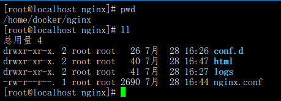

### **一、Nginx安装**

1. #### 下载nginx安装包

```shell
wget http://nginx.org/download/nginx-1.16.1.tar.gz
```

2. 解压并进入解压后的nginx目录

```shell
tar -xzvf nginx-1.16.1.tar.gz
cd nginx-1.16.1
```

3. 安装依赖软件包

```shell
yum install -y pcre pcre-devel openssl openssl-devel gcc gcc-c++ ncurses-devel perl
```

4. 编译，编译时一定要添加--with-http_ssl_module，以便让nginx支持ssl功能

```shell
./configure --prefix=/usr/local/nginx --with-http_stub_status_module --with-http_ssl_module
make
make install
```


### **二、Nginx基础**

1. location是如何匹配的？

```conf
location = / {
	# 精确匹配 /，主机名后面不能带任何字符串
	[ configuration A ]
}

location / {
	# 因为所有的地址都以 / 开头，所以这条规则将匹配所有请求
	# 但是正则和最长字符串会优先匹配
	[ configuration B ]
}

location /documents/ {
	# 匹配任何以 /documents/ 开头的地址，匹配符合以后，还要继续往下搜索
	# 只有后面的正则表达式没有匹配到时，这一条才会被采用
	[ configuration C ]
}

location ~ /documents/Abc {
	# 匹配任何以 /documents/ 开头的地址，匹配符合以后，还要继续往下搜索
	# 只有后面的正则表达式没有匹配到时，这一条才会被采用
	[ configuration CC ]
}

location ^~ /images/ {
	# 匹配任何以 /images/ 开头的地址，匹配符合以后，停止往下搜索正则，采用这一条
	[ configuration D ]
}

location ~* \.(gif|jpg|jpeg)$ {
	# 匹配所有以 gif,jpg或jpeg结尾的请求
	# 然而，所有请求 /images/ 下的图片会被 configuration D 处理，因为 ^~ 到达不了这一条正则
	[ configuration E ]
}

location /images/ {
	# 字符匹配到 /images/，继续往下，会发现 ^~ 存在
	[ configuration F ]
}

location /images/abc {
	# 最长字符串匹配到 /images/abc，继续往下，会发现 ^~ 存在
	# F与G的放置顺序是没有关系的
	[ configuration G ]
}

location ~ /images/abc/ {
	# 只有去掉 configuration D 才有效：先最长匹配 configuration G 开头的地址，继续往下搜索，匹配到这一条正则，采用
	[ configuration H ]
}
```

- = 开头，表示精确匹配
- ^~ 开头，表示uri以某个常规字符串开头，不是正则匹配
- ~ 开头，表示区分大小写的正则匹配
- ~* 开头，表示不区分大小写的正则匹配
- / 通用匹配，如果没有其他匹配，任何请求都会匹配到

**优先级：**

(location =) > (location 完整路径) > (location ^~ 路径) > (location ~/~* 正则顺序) > (location 部分起始路径) > (location /)

2. 如何配置rewrite?

> rewrite功能就是结合正则表达式和标志位实现url重写和重定向。rewrite只能放在server{}、location{}、if(){}块中，并且只能对域名后边的除去传递参数外的字符串起作用。如URL：http://www.baidu.com/querydeleted?page=1&pagesize=10，只对 /querydeleted 进行重写

3. 将http80端口的访问重定向配置

```conf
server {
	listen 80;
	server_name www.xxx.com;
	# 将http转到https
	rewrite ^ https://$http_host$request_uri? permanent;
}
```


4. 负载均衡

> upstream是Nginx的HTTP Upstream模块，这个模块通过一个简单的调度算法来实现客户端IP到后端服务器的负载均衡。
>
> Nginx的负载均衡模块目前支持4种调度算法：
>
> - 轮询（默认）。每个请求按时间顺序逐一分配到不同的后端服务器，如果后端某台服务器宕机，故障系统被自动剔除，使用户访问不受影响。Weight 指定轮询权值，Weight值越大，分配到的访问机率越高，主要用于后端每个服务器性能不均的情况下。
> - ip_hash。每个请求按访问IP的hash结果分配，这样来自同一个IP的访客固定访问一个后端服务器，有效解决了动态网页存在的session共享问题。
> - fair。这是比上面两个更加智能的负载均衡算法。此种算法可以依据页面大小和加载时间长短智能地进行负载均衡，也就是根据后端服务器的响应时间来分配请求，响应时间短的优先分配。Nginx本身是不支持fair的，如果需要使用这种调度算法，必须下载Nginx的upstream_fair模块。
> - url_hash。此方法按访问url的hash结果来分配请求，使每个url定向到同一个后端服务器，可以进一步提高后端缓存服务器的效率。Nginx本身是不支持url_hash的，如果需要使用这种调度算法，必须安装Nginx 的hash软件包。
>
> upstream可以设定每个后端服务器在负载均衡调度中的状态，支持的状态参数：
>
> - down。表示当前的server暂时不参与负载均衡
> - backup。预留的备份机器。当其他所有的非backup机器出现故障或者忙的时候，才会请求`backup`机器，因此这台机器的压力最轻。
> - max_fails。允许请求失败的次数，默认为`1`。当超过最大次数时，返回`proxy_next_upstream` 模块定义的错误。
> - fail_timeout。在经历了`max_fails`次失败后，暂停服务的时间。`max_fails`可以和`fail_timeout`一起使用。

5. 如何配置读写分离？

```conf
server {
	listen 80;
	server_name localhost;
	location / {
		proxy_pass http://192.168.0.101:8080;
		if ($request_method = "PUT") {
			proxy_pass http://192.168.0.102:8080
		}
	}
}
```

### **三、Nginx使用**

1. 常用命令

```shell
# 创建软链接
ln -s /usr/local/nginx/sbin/nginx /usr/local/bin

# 检查配置文件是否正确
/usr/local/nginx/sbin/nginx -t
# 启动nginx（默认配置文件 conf/nginx.conf，-c 指定配置文件）
/usr/local/nginx/sbin/nginx -c /usr/local/nginx/conf/nginx.conf
# 关闭nginx
/usr/local/nginx/sbin/nginx -s stop
pkill nginx
# 重启，不会改变启动时指定的配置文件
/usr/local/nginx/sbin/nginx -s reload

```


### **四、Docker启动Nginx**

1. 直接启动

```shell
docker run --name mynginx -d -p 8080:80 nginx:latest
```


2. 挂载Nginx文件夹和配置文件在宿主机

- 将所有nginx启动需要的文件放到/home/docker/nginx下，如下所示：



- 启动命令

```shell
docker run --name mynginx -d -p 80:80 -v /home/docker/nginx/html:/usr/share/nginx/html -v /home/docker/nginx/nginx.conf:/etc/nginx/nginx.conf -v /home/docker/nginx/conf.d/default.conf:/etc/nginx/conf.d/default.conf -v /home/docker/nginx/logs:/var/log/nginx nginx:latest
```

