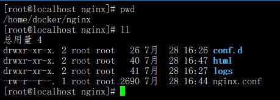

## Docker启动Nginx

### 一. 直接启动

docker run --name mynginx -d -p 8080:80 nginx:latest

### 二. 挂载Nginx文件夹和配置文件在宿主机

1. 将所有nginx启动需要的文件放到/home/docker/nginx下，如下所示：



2. 启动命令

```shell
docker run --name mynginx -d -p 80:80 -v /home/docker/nginx/html:/usr/share/nginx/html -v /home/docker/nginx/nginx.conf:/etc/nginx/nginx.conf -v /home/docker/nginx/conf.d/default.conf:/etc/nginx/conf.d/default.conf -v /home/docker/nginx/logs:/var/log/nginx nginx:latest
```

