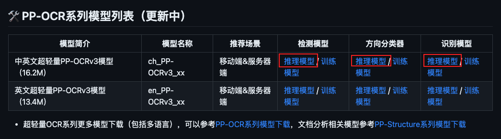
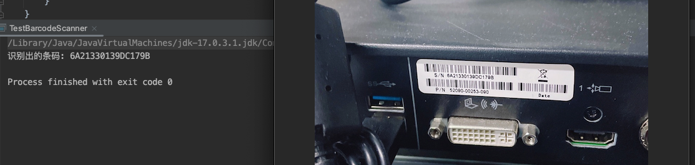

# 图片&条码内容识别调研

## 摘要

本文简要概述了OCR的概念和应用场景，以及条形码识别解决方案。OCR这块主要是调研并对比了几个github上star较多的开源项目以及阿里OCR（付费）。比较推荐百度开源的项目PaddleOCR，可直接使用其预训练模型进行演示，并且支持docker部署（实践通过）。可以支持身份证，车牌号，信用卡号识别。并且PaddleOCR支持重新训练模型，以及图像标注工具，扩展性强。条形码识别这块主要调研了冰蓝科技的Free Spire.Barcode（免费）。


## 1. OCR是什么

OCR （Optical Character Recognition，光学字符识别）
从图像化的文本信息中提取到文字符号做表征的语义信息，其重要性不言而喻，在实际应用场景中也比较容易想到跟NLP技术结合来完成比较优质的人机交互等任务。


## 2. OCR分类和算法解决方案

### 2.1 OCR分类和挑战

#### 2.1.1 按文字类型分类

手写体识别和印刷体识别。这两个可以认为是OCR领域两个大主题了，当然印刷体识别较手写体识别要简单得多，印刷体大多都是规则的字体，因为这些字体都是计算机自己生成再通过打印技术印刷到纸上。在印刷体的识别上有其独特的干扰：在印刷过程中字体很可能变得断裂或者墨水粘连，使得OCR识别异常困难。当然这些都可以通过一些图像处理的技术帮他尽可能的还原，进而提高识别率。总的来说，单纯的印刷体识别在业界已经能做到很不错了，但说100%识别是肯定不可能的，但是说识别得不错那是没毛病。

#### 2.1.2 按识别场景分类

可大致将 OCR 分为识别特定场景的专用 OCR 和识别多种场景的通用 OCR。比如车牌识别就是对特定场景的OCR，而对工业场景中的文字识别则是通用场景OCR。例如：医药品包装上的文字、各种钢制部件上的文字、容器表面的喷涂文字、商店标志上的个性文字等。在这样的图像中，字符部分可能出现在弯曲阵列、曲面异形、斜率分布、皱纹变形、不完整等各种形式中，并且与标准字符的特征大不相同，因此其识别难度相对困难。

#### 2.1.3 按应用场景分类

- 结构化文本

结构化的文本识别应用场景包括识别车牌、身份证、火车票、增值税发票、银行卡、护照、快递单等小垂类。这些小垂类的共同特点是格式固定，因此非常适合使用OCR技术进行自动化，可以极大的减轻人力成本，提升效率，也是目前OCR应用最广泛、并且技术相对较成熟的场景。

- 视频场景

除了面向垂类的结构化文本识别，通用OCR也有很多应用，其中一个热门的应用场景是视频。视频里面常见文字包括：字幕、标题、广告、弹幕等。

#### 2.1.4 OCR 面临挑战
  对应到OCR技术实现问题上，则一般面临仿射变换、尺度问题、光照不足、拍摄模糊等技术难点； 另外OCR应用常对接海量数据，因此要求数据能够得到实时处理；并且OCR应用常部署在移动端或嵌入式硬件，而端侧的存储空间和计算能力有限，因此对OCR模型的大小和预测速度有很高的要求。

### 2.2 OCR算法解决方案

- 传统特征提取方案
  特征提取、分类性设计等相关的基础技术

- 文本检测+文本识别，two-stage方案
  文本检测：检测出输入图片中文字所在区域。

CTPN：基于回归的算法。

CTPN是ECCV 2016提出的一种基于box回归文字检测算法，由Faster RCNN改进而来，结合了CNN与LSTM深度网络，其支持任意尺寸的图像输入，并能够直接在卷积层中定位文本行。

CTPN检测横向分布的文字效果较好。由于算法中加入了双向LSTM学习文本的序列特征，有利于文字的检测，但是LSTM的不易训练问题需谨慎。是目前比较成熟的文本检测框架，精确度较好。但是检测时间较长，有很大的优化空间。预测文本的竖直方向上的位置，水平方向的位置不预测。对于非水平的文字不能检测。这类算法对规则形状文本检测效果较好，但无法准确检测不规则形状文本。

PSENet：基于分割的算法

这类算法不受文本形状的限制，对各种形状的文本都能取得较好的效果，但是往往后处理比较复杂，导致耗时严重。目前也有一些算法专门针对这个问题进行改进，如DB，将二值化进行近似，使其可导，融入训练，从而获取更准确的边界，大大降低了后处理的耗时。

文本识别
基于CTC的算法：CRNN

CNN+RNN+CTC是一个很经典的端到端模型，总体来说就是用CNN提取图片特征；将提取到的特征转换成特征序列作为RNN的输入，用于对卷积层输出的特征序列的每一帧进行预测；最后使用CTC算法将循环层的每帧预测转化为标签序列。因为RNN可以处理任意长度的序列，所以仅仅需要固定输入图片的高度，宽度不定长。CRNN是目前最为广泛的一种文本识别框架。需要自己构建字词库（包含常用字、各类字符等）。

基于Attention的算法

attention机制虽然很火，做英文识别效果确实也非常好，但是做中文尤其是中文长文本识别可能是干不过CTC的。并且Attention的串行解码结构限制了预测速度。

- 端到端方案
端到端在文字分布密集的业务场景，效率会比较有保证，精度的话看自己业务数据积累情况，如果行级别的识别数据积累比较多的话two-stage会比较好。百度的落地场景，比如工业仪表识别、车牌识别都用到端到端解决方案。


## 3. OCR开源项目调研


### 3.1 [PaddleOCR](https://github.com/PaddlePaddle/PaddleOCR)

百度开源项目，文档完善，2020年6月开源。PaddleOCR 旨在打造一套丰富、领先、且实用的 OCR 工具库，助力使用者训练出更好的模型，并应用落地。

PaddleOCR 是基于飞桨的 OCR 工具库，包含总模型仅8.6M的超轻量级中文 OCR，单模型支持中英文数字组合识别、竖排文本识别、长文本识别。同时支持多种文本检测、文本识别的训练算法。

### 3.2 [tesseract](https://github.com/tesseract-ocr/tesseract)

谷歌开源项目，支持100多种语言。中文效果不如PaddleOCR，识别时间较长，需优化。


## 4. 付费OCR

### 4.1 [阿里OCR服务](https://ai.aliyun.com/ocr?spm=5176.28055625.J_8569522920.80.de41154aNBy1k4&scm=20140722.X_data-5bac72472fce3089e86b._.V_1)

文字识别（OCR）可以将图片中的文字信息转换为可编辑文本，阿里云根据客户的业务场景和需求，将产品分为了通用文字识别、个人证照识别、票据凭证识别、教育场景识别、车辆物流识别、企业资质识别、小语种文字识别、医疗场景识别等众多产品，满足各种客户的图片识别需求。

#### 4.1.1 可[免费体验](https://duguang.aliyun.com/experience?type=universal)

#### 4.1.2 测试结果


## 5. 主要开源项目对比和结论

### 5.1 对比

| 项目名称  | 优缺点 | 内容                                                         |
| :-------: | :----: | :----------------------------------------------------------- |
| PaddleOCR |  优点  | 百度准确率高，支持英文、法语、德语、韩语、日语，支持自训练，支持倾斜、竖排等多种方向文字识别 |
|           |  缺点  | 偏向中文识别，语言支持有限                                   |
|           |  部署  | 支持本地部署，云端部署，手机端集成部署，docker               |
| tesseract |  优点  | 谷歌开源，支持100多种语言，英文和数字识别准确率高            |
|           |  缺点  | 单纯中文识别准确率需优化                                     |
|           |  部署  | c或c++ API                                                   |


### 5.2 结论

1. 如果要求支持中文，建议使用百度开源的PaddleOCR
理由：中文支持友好，文档完善，有标注工具，方便后期训练，优化模型。部署简单。面向工业化场景。
其他：使用GPU机器可提高计算效率，目前的CPU上识别速度大概0.9s。

2. 如果要求支持多语言，建议使用谷歌开源的 tesseract。支持100多种语言。使用人数最多。本地也测试过，感觉效果不如PaddleOCR。

3. 如果考虑部署维护及安全性相关，可直接购买阿里OCR服务。


## 6. PaddleOCR落地方案

### 6.1 快速安装

```shell
# 更新pip至最新版本
python3 -m pip install -U pip
```

#### 6.1.1 安装PaddlePaddle

- 您的机器安装的是CUDA9或CUDA10，请运行以下命令安装

```bash
pip install paddlepaddle-gpu -i https://mirror.baidu.com/pypi/simple
```

- 您的机器是CPU，请运行以下命令安装

```bash
pip install paddlepaddle -i https://mirror.baidu.com/pypi/simple
```

更多的版本需求，请参照[飞桨官网安装文档](https://www.paddlepaddle.org.cn/install/quick)中的说明进行操作。

#### 6.1.2 安装PaddleOCR whl包

```bash
pip install paddleocr -i https://mirror.baidu.com/pypi/simple
```

#### 6.1.3 Python脚本使用

```python
from paddleocr import PaddleOCR, draw_ocr
import cv2

ocr = PaddleOCR(use_angle_cls=True, use_gpu=False)
img_path = '/Users/luocong/Downloads/barcode_001.png'
img = cv2.imread(img_path)
result = ocr.ocr(img, cls=True)
print('\n<=====开始打印识别数据=====>\n')
for t in result:
    for a in t:
        print(a[1][0])

# 显示结果
# 如果本地没有simfang.ttf，可以在doc/fonts目录下下载
from PIL import Image
result = result[0]
image = Image.open(img_path).convert('RGB')
boxes = [line[0] for line in result]
txts = [line[1][0] for line in result]
scores = [line[1][1] for line in result]
im_show = draw_ocr(image, boxes, txts, scores, font_path='simfang.ttf')
im_show = Image.fromarray(im_show)
im_show.save('result.jpg')
```

#### 6.1.4 测试结果


### 6.2 如何部署

#### 6.2.1 PaddleHub Serving的服务部署

使用PaddleHub能够快速进行模型预测，但开发者常面临本地预测过程迁移线上的需求。无论是对外开放服务端口，还是在局域网中搭建预测服务，都需要PaddleHub具有快速部署模型预测服务的能力。在这个背景下，模型一键服务部署工具——PaddleHub Serving应运而生。开发者通过一行命令即可快速启动一个模型预测在线服务，而无需关注网络框架选择和实现。

PaddleHub提供便捷的模型转服务的能力，只需简单一行命令即可完成模型的HTTP服务部署。

#### 6.2.2 安装paddlehub

```shell
pip install paddlehub --upgrade -i https://mirror.baidu.com/pypi/simple
```

#### 6.2.3 启动服务

##### 6.2.3.1 命令行命令启动（仅支持CPU）
**启动命令：** 
```shell
hub serving start --modules [Module1==Version1, Module2==Version2, ...] \
                    --port XXXX \
                    --use_multiprocess \
                    --workers \
```

**参数：** 

|参数|用途| 
|---|---| 
|--modules/-m|PaddleHub Serving预安装模型，以多个Module==Version键值对的形式列出<br>*`当不指定Version时，默认选择最新版本`*| 
|--port/-p|服务端口，默认为8866| 
|--use_multiprocess|是否启用并发方式，默认为单进程方式，推荐多核CPU机器使用此方式<br>*`Windows操作系统只支持单进程方式`*|
|--workers|在并发方式下指定的并发任务数，默认为`2*cpu_count-1`，其中`cpu_count`为CPU核数| 

如启动串联服务：  ```hub serving start -m ocr_system``` 

这样就完成了一个服务化API的部署，使用默认端口号8866。

##### 6.2.3.2 配置文件启动（支持CPU、GPU）
**启动命令：** 
```hub serving start -c config.json``` 

其中，`config.json`格式如下：
```python
{
    "modules_info": {
        "ocr_system": {
            "init_args": {
                "version": "1.0.0",
                "use_gpu": true
            },
            "predict_args": {
            }
        }
    },
    "port": 8868,
    "use_multiprocess": false,
    "workers": 2
}
```

- `init_args`中的可配参数与`module.py`中的`_initialize`函数接口一致。其中，**当`use_gpu`为`true`时，表示使用GPU启动服务**。  
- `predict_args`中的可配参数与`module.py`中的`predict`函数接口一致。

**注意:** 
- 使用配置文件启动服务时，其他参数会被忽略。
- 如果使用GPU预测(即，`use_gpu`置为`true`)，则需要在启动服务之前，设置CUDA_VISIBLE_DEVICES环境变量，如：```export CUDA_VISIBLE_DEVICES=0```，否则不用设置。
- **`use_gpu`不可与`use_multiprocess`同时为`true`**。

如，使用GPU 3号卡启动串联服务： 

```shell
export CUDA_VISIBLE_DEVICES=3
hub serving start -c deploy/hubserving/ocr_system/config.json
```

#### 6.2.4 发送预测请求

```python
tools/test_hubserving.py --server_url=http://127.0.0.1:8868/predict/ocr_system --image_dir=./doc/imgs/ --visualize=false
```

### 6.3 docker部署

和官网的操作步骤不同，有适当的调整，已经实践通过，推荐使用。docker镜像大小6.98G。实验的是CPU版本，识别速度在1s以内。如果有GPU可以加快速度。

步骤1: 下载PaddleOCR项目

```shell
git clone https://github.com/PaddlePaddle/PaddleOCR.git
```

步骤2: 下载模型文件，解压放到目录PaddleOCR/inference下



步骤3: 在同级目录下增加Dockerfile文件

Dockerfile文件内容如下
```shell
# Version: 2.0.0
FROM registry.baidubce.com/paddlepaddle/paddle:2.4.2

# PaddleOCR base on Python3.7
RUN pip3.7 install --upgrade pip -i https://mirror.baidu.com/pypi/simple

RUN pip3.7 install paddlehub --upgrade -i https://mirror.baidu.com/pypi/simple

WORKDIR /

COPY ./PaddleOCR /PaddleOCR

WORKDIR /PaddleOCR

RUN pip3.7 install -r requirements.txt -i https://mirror.baidu.com/pypi/simple

EXPOSE 8868

CMD ["/bin/bash","-c","hub install deploy/hubserving/ocr_system/ && hub serving start -c deploy/hubserving/ocr_system/config.json"]
```

步骤4: 生成镜像，启动paddleocr容器

```shell
# 从Dockerfile生成镜像
docker build -t paddleocr:cpu .

# 启动docker容器
sudo docker run -d -p 8868:8868 --name paddle_ocr paddleocr:cpu

# 检查服务运行
docker logs -f paddle_ocr

# 检查服务运行
cd PaddleOCR
python tools/test_hubserving.py 
```


## 7. 阿里OCR服务使用

[RecognizeGeneral - 通用文字识别](https://help.aliyun.com/document_detail/442250.html?spm=a2c4g.442328.0.i8)

### 7.1 安装依赖

#### 7.1.1 Apache Maven

```xml
<dependency>
  <groupId>com.aliyun</groupId>
  <artifactId>ocr_api20210707</artifactId>
  <version>1.1.15</version>
</dependency>
```

#### 7.1.2 Gradle

```xml
implementation 'com.aliyun:ocr_api20210707:1.1.15'
```

### 7.2 购买通用文字识别资源包

[通用文字识别资源包](https://common-buy.aliyun.com/?spm=api-workbench.API%20Document.0.0.30054dc37e9M9f&commodityCode=ocr_general_dp_cn&request=%7B%22ord_time%22:%221:Year%22,%22order_num%22:1,%22pack%22:%22ocr_general_dp_cn_20211103172431_0908%22,%22flowout_spec%22:%22500%22%7D)

### 7.3 Java SDK 示例代码

```java
public class TestAliOCR {

    /**
     * 使用AK&SK初始化账号Client
     * @param accessKeyId
     * @param accessKeySecret
     * @return Client
     * @throws Exception
     */
    public static com.aliyun.ocr_api20210707.Client createClient(String accessKeyId, String accessKeySecret) throws Exception {
        com.aliyun.teaopenapi.models.Config config = new com.aliyun.teaopenapi.models.Config()
                // 必填，您的 AccessKey ID
                .setAccessKeyId(accessKeyId)
                // 必填，您的 AccessKey Secret
                .setAccessKeySecret(accessKeySecret);
        // Endpoint 请参考 https://api.aliyun.com/product/ocr-api
        config.endpoint = "ocr-api.cn-hangzhou.aliyuncs.com";
        return new com.aliyun.ocr_api20210707.Client(config);
    }

    public static void main(String[] args_) throws Exception {
        java.util.List<String> args = java.util.Arrays.asList(args_);
        // 请确保代码运行环境设置了环境变量 ALIBABA_CLOUD_ACCESS_KEY_ID 和 ALIBABA_CLOUD_ACCESS_KEY_SECRET。
        // 工程代码泄露可能会导致 AccessKey 泄露，并威胁账号下所有资源的安全性。以下代码示例使用环境变量获取 AccessKey 的方式进行调用，仅供参考，建议使用更安全的 STS 方式，更多鉴权访问方式请参见：https://help.aliyun.com/document_detail/378657.html
        com.aliyun.ocr_api20210707.Client client = TestAliOCR.createClient(System.getenv("ALIBABA_CLOUD_ACCESS_KEY_ID"), System.getenv("ALIBABA_CLOUD_ACCESS_KEY_SECRET"));
        com.aliyun.ocr_api20210707.models.RecognizeBasicRequest recognizeBasicRequest = new com.aliyun.ocr_api20210707.models.RecognizeBasicRequest()
                .setBody(new FileInputStream("file_path"));
        try {
            // 复制代码运行请自行打印 API 的返回值
            com.aliyun.ocr_api20210707.models.RecognizeBasicResponse response = client.recognizeBasicWithOptions(recognizeBasicRequest, new com.aliyun.teautil.models.RuntimeOptions());
            System.out.println(new Gson().toJson(response.getBody()));
        } catch (TeaException error) {
            // 如有需要，请打印 error
            com.aliyun.teautil.Common.assertAsString(error.message);
        } catch (Exception _error) {
            TeaException error = new TeaException(_error.getMessage(), _error);
            // 如有需要，请打印 error
            com.aliyun.teautil.Common.assertAsString(error.message);
        }
    }
}
```


## 8. [Free Spire.Barcode for Java](https://www.e-iceblue.cn/Introduce/Free-Spire-Barcode-JAVA.html)

Free Spire.Barcode for Java 是 Spire.Barcode for Java 的免费产品。Free Spire.Barcode for Java 是一款基于 Java 语言开发的，免费的专门对条形码进行操作的类库。适用于商业或个人用途。这款产品的主要功能在于帮助开发人员轻松快捷高效地生成、读取和扫描一维条码和二维条码。

### 8.1 安装依赖

```xml
<dependency>
  <groupId>e-iceblue</groupId>
  <artifactId>spire.barcode.free</artifactId>
  <version>5.1.1</version>
</dependency>
```

### 8.2 Java SDK 示例代码

```java
public class TestBarcodeScanner {

    public static void main(String[] args) throws Exception {
        String[] scan = BarcodeScanner.scan("/Users/luocong/Downloads/barcode_001.png", BarCodeType.Code_93);
        if (scan != null) {
            for (String s : scan) {
                System.out.println("识别出的条码: " + s);
            }
        }
    }
}
```

### 8.3 识别结果




## 参考文献

[PaddleOCR](https://github.com/PaddlePaddle/PaddleOCR)
[tesseract](https://github.com/tesseract-ocr/tesseract)
[阿里云文字识别（OCR）](https://help.aliyun.com/product/252763.html?spm=5176.12127803.J_5253785160.6.47145542f2LYnG)
[Free Spire.Barcode for Java](https://www.e-iceblue.cn/Introduce/Free-Spire-Barcode-JAVA.html)
