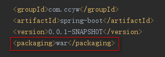
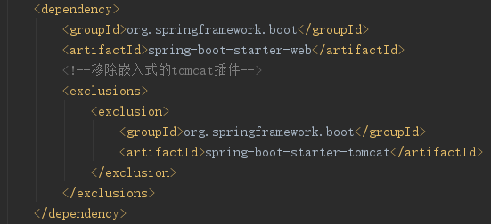
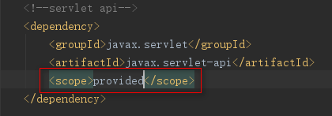
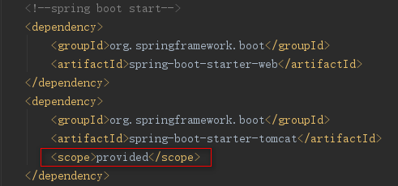
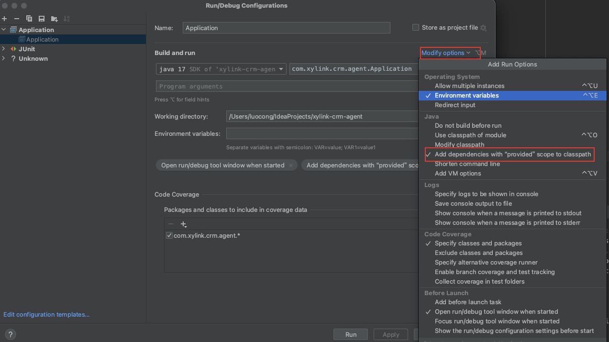
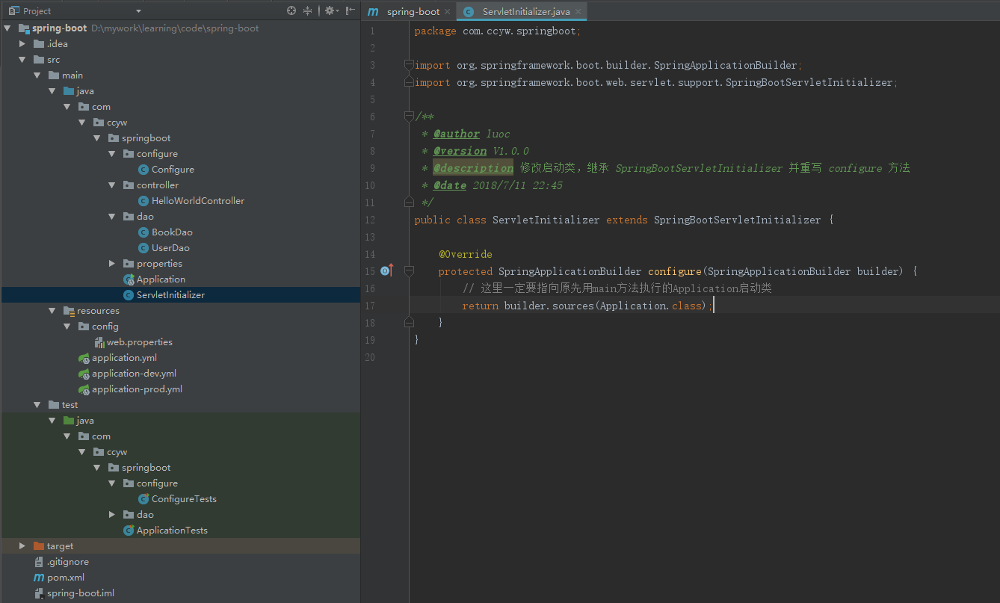
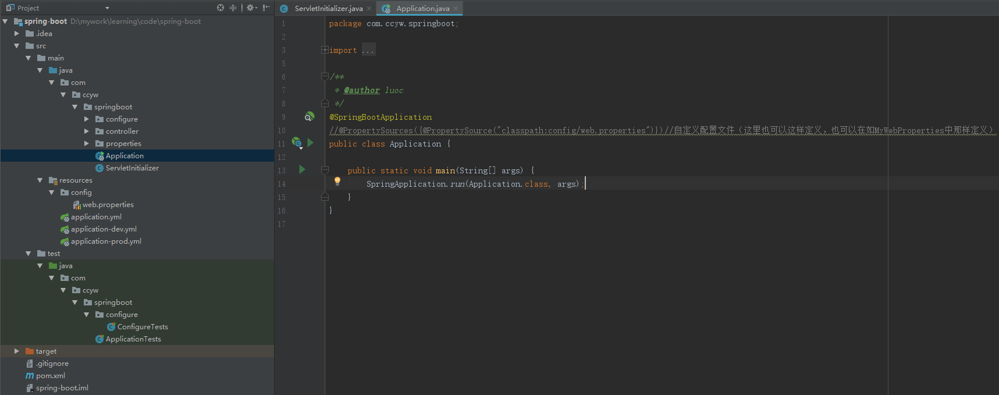

## 
Spring Boot war 包部署

### 一、pom.xml文件中修改
#### 方式一（使用这种方式开发时不能直接 run Application，因为没有Tomcat容器了）
1. 改为打成war包

 

2. 移除SpringBoot自带的嵌入式Tomcat

 

3. 添加servlet-api依赖

 

#### 方式二（使用这种方式开发时可以直接 run Application）
1. 改为打成war包

 

2. 修改tomcat依赖

 

3. IDEA 里 Run Configurations里加配置

### 二、继承SpringBootServletInitializer类，并重写configure方法

1. 继承SpringBootServletInitializer类，并重写configure方法

 

2. 保持原SpringBoot启动类不变

 

