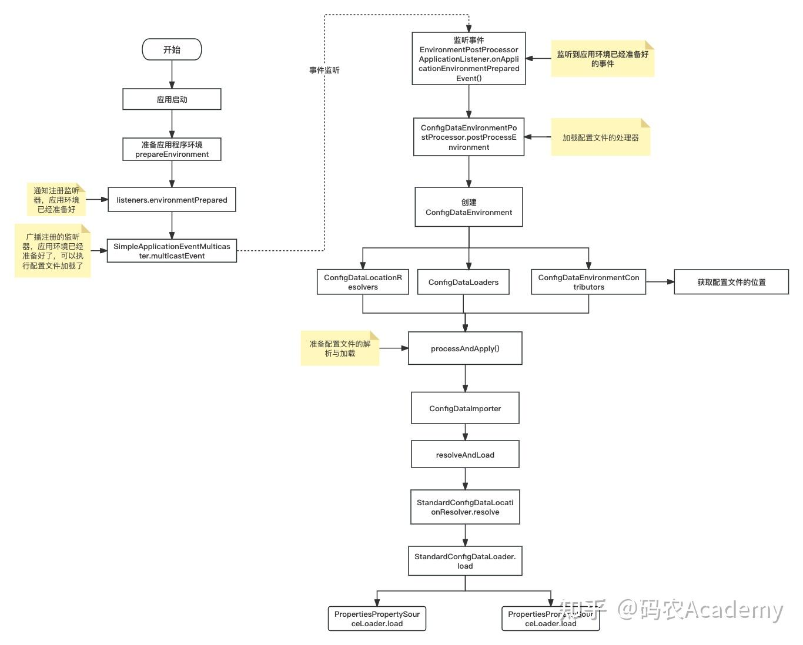

## Spring Boot 配置文件加载顺序


### 1、项目内配置文件的加载顺序

Spring Boot 启动会扫描以下位置的application.properties或者application.yml 文件作为Spring Boot 的默认配置文件。

| 路径              | 描述                          | 优先级     |
| ----------------- | ----------------------------- | ---------- |
| file:…/config/    | 项目根目录config文件夹下      | 优先级最高 |
| file:…/           | 项目根目录下                  | 优先级第二 |
| classpath:/config | resources目录中config文件夹下 | 优先级第三 |
| classpath:/       | resources目录下               | 优先级最低 |


### 2、加载配置文件大致流程




### 3、源码解析

#### 1）准备应用程序环境

##### 启动服务 SpringApplication#run(java.lang.String...)

```java
// 1、执行 prepareEnvironment 方法准备环境
ConfigurableEnvironment environment = prepareEnvironment(listeners, bootstrapContext, applicationArguments);

private ConfigurableEnvironment prepareEnvironment(SpringApplicationRunListeners listeners,
			DefaultBootstrapContext bootstrapContext, ApplicationArguments applicationArguments) {
		// Create and configure the environment
		ConfigurableEnvironment environment = getOrCreateEnvironment();
		configureEnvironment(environment, applicationArguments.getSourceArgs());
		ConfigurationPropertySources.attach(environment);
  	// 2、通知注册的监听器，应用程序的环境已经准备好
		listeners.environmentPrepared(bootstrapContext, environment);
		DefaultPropertiesPropertySource.moveToEnd(environment);
		Assert.state(!environment.containsProperty("spring.main.environment-prefix"),
				"Environment prefix cannot be set via properties.");
		bindToSpringApplication(environment);
		if (!this.isCustomEnvironment) {
			EnvironmentConverter environmentConverter = new EnvironmentConverter(getClassLoader());
			environment = environmentConverter.convertEnvironmentIfNecessary(environment, deduceEnvironmentClass());
		}
		ConfigurationPropertySources.attach(environment);
		return environment;
	}
```

##### SpringApplicationRunListeners#environmentPrepared

```java
void environmentPrepared(ConfigurableBootstrapContext bootstrapContext, ConfigurableEnvironment environment) {
		doWithListeners("spring.boot.application.environment-prepared",
				(listener) -> listener.environmentPrepared(bootstrapContext, environment));
	}

// doWithListeners 遍历注册的监听器，对每个监听器执行 environmentPrepared 操作，通知它们应用程序的环境已经准备好
private void doWithListeners(String stepName, Consumer<SpringApplicationRunListener> listenerAction) {
		doWithListeners(stepName, listenerAction, null);
	}

	private void doWithListeners(String stepName, Consumer<SpringApplicationRunListener> listenerAction,
			Consumer<StartupStep> stepAction) {
		StartupStep step = this.applicationStartup.start(stepName);
		this.listeners.forEach(listenerAction);
		if (stepAction != null) {
			stepAction.accept(step);
		}
		step.end();
	}
```

##### EventPublishingRunListener#environmentPrepared

```java
// 处理应用事件的组件SimpleApplicationEventMulticaster开始执行multicastEvent去广播环境准备事件ApplicationEnvironmentPreparedEvent给注册的监听器，环境已经准备好，让他们可以执行环境准备阶段的自定义逻辑

private final SimpleApplicationEventMulticaster initialMulticaster;

@Override
	public void environmentPrepared(ConfigurableBootstrapContext bootstrapContext,
			ConfigurableEnvironment environment) {
		this.initialMulticaster.multicastEvent(
				new ApplicationEnvironmentPreparedEvent(bootstrapContext, this.application, this.args, environment));
	}

// 至此，应用程序环境已经准备好的事件已经广播出去，接下来EnvironmentPostProcessorApplicationListener监听器监听到事件后就可以开始处理读取配置文件的逻辑
```


#### 2）准备加载配置文件环境

##### EnvironmentPostProcessorApplicationListener#onApplicationEvent

```java
// EnvironmentPostProcessorApplicationListener监听到ApplicationEnvironmentPreparedEvent即环境已经准备好的事件，开始处理执行实现 EnvironmentPostProcessor类的postProcessEnvironment方法

@Override
	public void onApplicationEvent(ApplicationEvent event) {
		if (event instanceof ApplicationEnvironmentPreparedEvent) {
			onApplicationEnvironmentPreparedEvent((ApplicationEnvironmentPreparedEvent) event);
		}
		if (event instanceof ApplicationPreparedEvent) {
			onApplicationPreparedEvent();
		}
		if (event instanceof ApplicationFailedEvent) {
			onApplicationFailedEvent();
		}
	}

private void onApplicationEnvironmentPreparedEvent(ApplicationEnvironmentPreparedEvent event) {
		ConfigurableEnvironment environment = event.getEnvironment();
		SpringApplication application = event.getSpringApplication();
		for (EnvironmentPostProcessor postProcessor : getEnvironmentPostProcessors(application.getResourceLoader(),
				event.getBootstrapContext())) {
			postProcessor.postProcessEnvironment(environment, application);
		}
	}

```

##### 而注册`EnvironmentPostProcessor` 实现类的有7个。都是加载类路径下的`META-INF/spring.factories` 文件中配置的`EnvironmentPostProcessor`实现类

```factories
# Environment Post Processors
org.springframework.boot.env.EnvironmentPostProcessor=\
org.springframework.boot.cloud.CloudFoundryVcapEnvironmentPostProcessor,\
org.springframework.boot.context.config.ConfigDataEnvironmentPostProcessor,\
org.springframework.boot.env.RandomValuePropertySourceEnvironmentPostProcessor,\
org.springframework.boot.env.SpringApplicationJsonEnvironmentPostProcessor,\
org.springframework.boot.env.SystemEnvironmentPropertySourceEnvironmentPostProcessor,\
org.springframework.boot.reactor.DebugAgentEnvironmentPostProcessor
```

##### `ConfigDataEnvironmentPostProcessor`就是用于处理加载配置文件的实现类。同时这里也是SpringBoot2.4.0前后版本关于加载配置文件差异的一个地方

```java
// ConfigDataEnvironmentPostProcessor开始执行postProcessEnvironment方法，创建ConfigDataEnvironment实例，然后执行其processAndApply

@Override
	public void postProcessEnvironment(ConfigurableEnvironment environment, SpringApplication application) {
		postProcessEnvironment(environment, application.getResourceLoader(), application.getAdditionalProfiles());
	}
	
void postProcessEnvironment(ConfigurableEnvironment environment, ResourceLoader resourceLoader,
			Collection<String> additionalProfiles) {
		try {
			this.logger.trace("Post-processing environment to add config data");
			resourceLoader = (resourceLoader != null) ? resourceLoader : new DefaultResourceLoader();
			getConfigDataEnvironment(environment, resourceLoader, additionalProfiles).processAndApply();
		}
		catch (UseLegacyConfigProcessingException ex) {
			this.logger.debug(LogMessage.format("Switching to legacy config file processing [%s]",
					ex.getConfigurationProperty()));
			configureAdditionalProfiles(environment, additionalProfiles);
			postProcessUsingLegacyApplicationListener(environment, resourceLoader);
		}
	}

	ConfigDataEnvironment getConfigDataEnvironment(ConfigurableEnvironment environment, ResourceLoader resourceLoader,
			Collection<String> additionalProfiles) {
		return new ConfigDataEnvironment(this.logFactory, this.bootstrapContext, environment, resourceLoader,
				additionalProfiles, this.environmentUpdateListener);
	}


```

##### ConfigDataEnvironment类在SpringBoot2.4.0版本引入，它是SpringBoot配置数据加载和管理的核心组件。它负责从多个源加载、解析和处理配置数据，并将这些数据整合到应用环境中。在这里主要去创建ConfigDataLocationResolvers，ConfigDataLoaders以及ConfigDataEnvironmentContributors

```java
ConfigDataEnvironment(DeferredLogFactory logFactory, ConfigurableBootstrapContext bootstrapContext,
			ConfigurableEnvironment environment, ResourceLoader resourceLoader, Collection<String> additionalProfiles,
			ConfigDataEnvironmentUpdateListener environmentUpdateListener) {
		Binder binder = Binder.get(environment);
		UseLegacyConfigProcessingException.throwIfRequested(binder);
		this.logFactory = logFactory;
		this.logger = logFactory.getLog(getClass());
		this.notFoundAction = binder.bind(ON_NOT_FOUND_PROPERTY, ConfigDataNotFoundAction.class)
			.orElse(ConfigDataNotFoundAction.FAIL);
		this.bootstrapContext = bootstrapContext;
		this.environment = environment;
  	// ConfigDataLocationResolvers在SpringBoot2.4.0版本中引入，是负责解析和定位配置数据源位置的一个组件集合。是一个工厂类，用于创建配置数据位置解析器的实例，它包含了一组ConfigDataLocationResolver的实现类，目前只有两个实现类：StandardConfigDataLocationResolver以及ConfigTreeConfigDataLocationResolver
    // 其中ConfigTreeConfigDataLocationResolver主要用于解析Config Tree 类型的配置数据位置。Config Tree是SpringBoot2.4.0引入的一种配置数据存储格式，可以将配置文件以树形结构组织，使得配置文件之间的关系更加清晰。
		// 而StandardConfigDataLocationResolver它用于解析标准的配置数据位置，即 SpringBoot2.4之前版本中使用的传统配置文件存放方式。这种方式通常是将配置文件放在类路径下的config目录中，或者在文件系统的特定位置，例如我们常写的applicaiton.properties或者applicaiton.yml。这个类也是本文用于加载配置文件的解析器
		this.resolvers = createConfigDataLocationResolvers(logFactory, bootstrapContext, binder, resourceLoader);
		this.additionalProfiles = additionalProfiles;
		this.environmentUpdateListener = (environmentUpdateListener != null) ? environmentUpdateListener
				: ConfigDataEnvironmentUpdateListener.NONE;
  	// ConfigDataLoaders是SpringBoot中处理配置数据加载的组件，也是SpringBoot2.4.0引入。它是一个工厂类，用于创建配置数据加载器的实例，配置数据加载器均实现ConfigDataLoader接口。在SpringBoot中，配置数据加载器负责实际加载配置数据，将配置文件的内容解析成应用程序可用的配置信息。同样的他也只有两个实现类：ConfigTreeConfigDataLoader和StandardConfigDataLoader
    // 同解析器，ConfigTreeConfigDataLoader主要用于加载Config Tree类型的配置数据。而StandardConfigDataLoader 用于加载标准的配置数据
		this.loaders = new ConfigDataLoaders(logFactory, bootstrapContext, resourceLoader.getClassLoader());
    // ConfigDataEnvironmentContributors是SpringBoot中用于管理配置数据环境贡献者的组件。它的主要作用是维护一组贡献者，这些贡献者负责提供配置数据的加载、处理和管理。同样也是SpringBoot 2.4.0之后引入。它从特定的源或根据特定规则加载并解析配置数据，然后将解析后的结果（通常是以PropertySource形式）添加到ConfigDataEnvironment对象中。并且负责按照预定义的顺序和优先级策略来加载和合并不同来源的配置信息，确保正确地覆盖和合并属性值。不同的ConfigDataEnvironmentContributor可以响应不同的环境变量、系统属性或激活的profile，从而动态地调整加载哪些配置数据
		this.contributors = createContributors(binder);
	}


```


##### ConfigDataEnvironmentContributors（SpringBoot加载的文件的默认位置以及加载文件的顺序）

```java
private List<ConfigDataEnvironmentContributor> getInitialImportContributors(Binder binder) {
		List<ConfigDataEnvironmentContributor> initialContributors = new ArrayList<>();
		addInitialImportContributors(initialContributors, bindLocations(binder, IMPORT_PROPERTY, EMPTY_LOCATIONS));
		addInitialImportContributors(initialContributors,
				bindLocations(binder, ADDITIONAL_LOCATION_PROPERTY, EMPTY_LOCATIONS));
		addInitialImportContributors(initialContributors,
				bindLocations(binder, LOCATION_PROPERTY, DEFAULT_SEARCH_LOCATIONS));
		return initialContributors;
	}

private void addInitialImportContributors(List<ConfigDataEnvironmentContributor> initialContributors,
			ConfigDataLocation[] locations) {
		for (int i = locations.length - 1; i >= 0; i--) {
			initialContributors.add(createInitialImportContributor(locations[i]));
		}
	}

// 此时他的工作是获取与给定源相关联的Binder，用于对配置数据进行绑定操作。执行getInitialImportContributors(binder)方法获取初始导入的配置数据贡献者，加入到贡献者列表中
// 这个方法就很重要了，这里就是SpringBoot加载的文件的默认位置以及加载文件的顺序。

// 执行第1个方法时，可以通过IMPORT_PROPERTY即spring.config.import这个值可以指定要导入的额外配置数据位置，这些位置将会在配置数据加载时被导入。SpringBoot将会使用该属性指定的位置作为主要的配置数据来源，并将其导入到应用程序的配置中。这个属性通常用于指定一个主要的配置文件，覆盖默认的配置文件位置。它的优先级也是最高的。例如：
// spring.config.import=classpath:/imported-config/application.yml

// 执行第2个方法即绑定ADDITIONAL_LOCATION_PROPERTY指定的目录spring.config.additional-location，这个目录用于指定额外的配置数据导入位置。指定的额外导入位置会在主要位置之外被考虑。这个属性用于添加额外的配置数据位置，可以与主要位置一起使用，而不是替代它

// 然后就是第3个方法，绑定LOCATION_PROPERTY指定的目录spring.config.location。该目录作为主要的配置数据位置。可以通过设置该属性来指定主要的配置数据位置，这个位置会被优先考虑，覆盖默认的位置。而默认位置有如下:

static {
		List<ConfigDataLocation> locations = new ArrayList<>();
		locations.add(ConfigDataLocation.of("optional:classpath:/;optional:classpath:/config/"));
		locations.add(ConfigDataLocation.of("optional:file:./;optional:file:./config/;optional:file:./config/*/"));
		DEFAULT_SEARCH_LOCATIONS = locations.toArray(new ConfigDataLocation[0]);
	}

// 其中optional代表可选的配置文件位置。由上述addInitialImportContributors可以看出默认配置文件加载顺序是从上到下优先级越来越高。即加载顺序为:
// optional:file:./;optional:file:./config/;optional:file:./config/*/
// optional:classpath:/;optional:classpath:/config/

// 这个加载顺序不同SrpingBoot2.4.0于以前的版本。

// 注意: 这里注意这个是加载文件的顺序，而不是加载读取配置的顺序。加载读取配置的顺序请往下看
// 其中file:./、file:./config/、file:./config/*/**都是在文件系统中搜索配置文件，这种方式适用于需要在文件系统上动态配置文件的场景，其中 * 可以匹配任意子目录。
// 而classpath:/、classpath:/config/则表示在类路径（classpath）下搜索配置文件，包括根路径和 /config/子路径。这种方式适用于将配置文件打包在应用程序的 JAR 文件中或者放在类路径下的config目录中。

// Contributors翻译为贡献者，类似给配置数据环境提供数据的加载，处理和管理的。
// 到这里ConfigDataEnvironment中关于加载和解析配置文件的部分就准备好了，接下来就开始执行processAndApply方法开始加载解析文件。
```

#### 3）配置文件加载解析

##### ConfigDataEnvironment#processAndApply

```java
void processAndApply() {
  	// 创建配置文件导入器ConfigDataImporter,将ConfigDataEnvironment中的加载器以及解析器都放入导入器中
		ConfigDataImporter importer = new ConfigDataImporter(this.logFactory, this.notFoundAction, this.resolvers,
				this.loaders);
		registerBootstrapBinder(this.contributors, null, DENY_INACTIVE_BINDING);
  	// 执行processInitial方法，然后配置数据贡献者ConfigDataEnvironmentContributors开始执行withProcessedImports方法开始执行加载以及解析配置文件。循环配置数据贡献者直至拿到所有的配置文件
		ConfigDataEnvironmentContributors contributors = processInitial(this.contributors, importer);
		ConfigDataActivationContext activationContext = createActivationContext(
				contributors.getBinder(null, BinderOption.FAIL_ON_BIND_TO_INACTIVE_SOURCE));
		contributors = processWithoutProfiles(contributors, importer, activationContext);
		activationContext = withProfiles(contributors, activationContext);
		contributors = processWithProfiles(contributors, importer, activationContext);
		applyToEnvironment(contributors, activationContext, importer.getLoadedLocations(),
				importer.getOptionalLocations());
	}

private ConfigDataEnvironmentContributors processInitial(ConfigDataEnvironmentContributors contributors,
			ConfigDataImporter importer) {
		this.logger.trace("Processing initial config data environment contributors without activation context");
		contributors = contributors.withProcessedImports(importer, null);
		registerBootstrapBinder(contributors, null, DENY_INACTIVE_BINDING);
		return contributors;
	}

// org.springframework.boot.context.config.ConfigDataEnvironmentContributors#withProcessedImports
ConfigDataEnvironmentContributors withProcessedImports(ConfigDataImporter importer,
			ConfigDataActivationContext activationContext) {
		ImportPhase importPhase = ImportPhase.get(activationContext);
		this.logger.trace(LogMessage.format("Processing imports for phase %s. %s", importPhase,
				(activationContext != null) ? activationContext : "no activation context"));
		ConfigDataEnvironmentContributors result = this;
		int processed = 0;
		while (true) {
			ConfigDataEnvironmentContributor contributor = getNextToProcess(result, activationContext, importPhase);
			if (contributor == null) {
				this.logger.trace(LogMessage.format("Processed imports for of %d contributors", processed));
				return result;
			}
			if (contributor.getKind() == Kind.UNBOUND_IMPORT) {
				ConfigDataEnvironmentContributor bound = contributor.withBoundProperties(result, activationContext);
				result = new ConfigDataEnvironmentContributors(this.logger, this.bootstrapContext,
						result.getRoot().withReplacement(contributor, bound));
				continue;
			}
			ConfigDataLocationResolverContext locationResolverContext = new ContributorConfigDataLocationResolverContext(
					result, contributor, activationContext);
			ConfigDataLoaderContext loaderContext = new ContributorDataLoaderContext(this);
			List<ConfigDataLocation> imports = contributor.getImports();
			this.logger.trace(LogMessage.format("Processing imports %s", imports));
      // 配置文件导入器执行resolveAndLoad方法开始执行解析和加载数据。这方法中分为resolve解析以及load加载数据
			Map<ConfigDataResolutionResult, ConfigData> imported = importer.resolveAndLoad(activationContext,
					locationResolverContext, loaderContext, imports);
			this.logger.trace(LogMessage.of(() -> getImportedMessage(imported.keySet())));
			ConfigDataEnvironmentContributor contributorAndChildren = contributor.withChildren(importPhase,
					asContributors(imported));
			result = new ConfigDataEnvironmentContributors(this.logger, this.bootstrapContext,
					result.getRoot().withReplacement(contributor, contributorAndChildren));
			processed++;
		}
	}

// org.springframework.boot.context.config.ConfigDataImporter#resolveAndLoad
Map<ConfigDataResolutionResult, ConfigData> resolveAndLoad(ConfigDataActivationContext activationContext,
			ConfigDataLocationResolverContext locationResolverContext, ConfigDataLoaderContext loaderContext,
			List<ConfigDataLocation> locations) {
		try {
			Profiles profiles = (activationContext != null) ? activationContext.getProfiles() : null;
			List<ConfigDataResolutionResult> resolved = resolve(locationResolverContext, profiles, locations);
			return load(loaderContext, resolved);
		}
		catch (IOException ex) {
			throw new IllegalStateException("IO error on loading imports from " + locations, ex);
		}
	}
// resolve会调用ConfigDataEnvironment中创建的解析器，比如：StandardConfigDataLocationResolver，然后去解析ConfigDataEnvironmentContributor中保存的配置文件的路径。StandardConfigDataLocationResolver会先把路径拿出来按照;进行拆分
//（方法在ConfigDataLocation中），然后组装每个路径下的文件位置信息，对于文件名默认都为application，对于文件类型，需要使用到PropertySourceLoader他有两个子类：YamlPropertySourceLoader和PropertiesPropertySourceLoader，通过getFileExtensions方法获取文件类型。其中PropertiesPropertySourceLoader对应properties和xml，而YamlPropertySourceLoader对应yml以及yaml


// 这样就可以用ConfigDataLocation路径+applicaiton+getFileExtensions得到一组文件路径。
private Deque<StandardConfigDataReference> getReferencesForConfigName(String name,
			ConfigDataLocation configDataLocation, String directory, String profile) {
		Deque<StandardConfigDataReference> references = new ArrayDeque<>();
		for (PropertySourceLoader propertySourceLoader : this.propertySourceLoaders) {
			for (String extension : propertySourceLoader.getFileExtensions()) {
				StandardConfigDataReference reference = new StandardConfigDataReference(configDataLocation, directory,
						directory + name, profile, extension, propertySourceLoader);
				if (!references.contains(reference)) {
					references.addFirst(reference);
				}
			}
		}
		return references;
	}

// 然后解析器会检查这些文件是否存在，如果不存在的则会过滤掉。
private List<StandardConfigDataResource> resolve(StandardConfigDataReference reference) {
		if (!this.resourceLoader.isPattern(reference.getResourceLocation())) {
			return resolveNonPattern(reference);
		}
		return resolvePattern(reference);
	}

private List<StandardConfigDataResource> resolveNonPattern(StandardConfigDataReference reference) {
		Resource resource = this.resourceLoader.getResource(reference.getResourceLocation());
		if (!resource.exists() && reference.isSkippable()) {
			logSkippingResource(reference);
			return Collections.emptyList();
		}
		return Collections.singletonList(createConfigResourceLocation(reference, resource));
	}

// 最后将找到的文件放入StandardConfigDataResource集合中返回，由load方法去加载数据
// load方法将resolve方法解析出来的文件路径,有对应的加载器去文件中将数据取出来
private Map<ConfigDataResolutionResult, ConfigData> load(ConfigDataLoaderContext loaderContext,
			List<ConfigDataResolutionResult> candidates) throws IOException {
		Map<ConfigDataResolutionResult, ConfigData> result = new LinkedHashMap<>();
  	// 注意: 这里需要注意的是，读取文件是从最后一个开始读取，即跟文件加载顺序相反，所以配置加载顺序为：
  	// file:./config/*/
		// file:./config/
		// file:./
		// classpath:/config/
		// classpath:/
		for (int i = candidates.size() - 1; i >= 0; i--) {
			ConfigDataResolutionResult candidate = candidates.get(i);
			ConfigDataLocation location = candidate.getLocation();
			ConfigDataResource resource = candidate.getResource();
			this.logger.trace(LogMessage.format("Considering resource %s from location %s", resource, location));
			if (resource.isOptional()) {
				this.optionalLocations.add(location);
			}
			if (this.loaded.contains(resource)) {
				this.logger
					.trace(LogMessage.format("Already loaded resource %s ignoring location %s", resource, location));
				this.loadedLocations.add(location);
			}
			else {
				try {
					ConfigData loaded = this.loaders.load(loaderContext, resource);
					if (loaded != null) {
						this.logger.trace(LogMessage.format("Loaded resource %s from location %s", resource, location));
						this.loaded.add(resource);
						this.loadedLocations.add(location);
						result.put(candidate, loaded);
					}
				}
				catch (ConfigDataNotFoundException ex) {
					handle(ex, location, resource);
				}
			}
		}
		return Collections.unmodifiableMap(result);
	}

// 此时的loaders.load即在ConfigDataEnvironment中创建的加载器，本文中使用StandardConfigDataLoader进行加载，然后在配置加载器中由文件类型对应的加载器进行数据加载
<R extends ConfigDataResource> ConfigData load(ConfigDataLoaderContext context, R resource) throws IOException {
		ConfigDataLoader<R> loader = getLoader(context, resource);
		this.logger.trace(LogMessage.of(() -> "Loading " + resource + " using loader " + loader.getClass().getName()));
		return loader.load(context, resource);
	}

// org.springframework.boot.context.config.StandardConfigDataLoader#load
@Override
	public ConfigData load(ConfigDataLoaderContext context, StandardConfigDataResource resource)
			throws IOException, ConfigDataNotFoundException {
		if (resource.isEmptyDirectory()) {
			return ConfigData.EMPTY;
		}
		ConfigDataResourceNotFoundException.throwIfDoesNotExist(resource, resource.getResource());
		StandardConfigDataReference reference = resource.getReference();
		Resource originTrackedResource = OriginTrackedResource.of(resource.getResource(),
				Origin.from(reference.getConfigDataLocation()));
		String name = String.format("Config resource '%s' via location '%s'", resource,
				reference.getConfigDataLocation());
		List<PropertySource<?>> propertySources = reference.getPropertySourceLoader().load(name, originTrackedResource);
		PropertySourceOptions options = (resource.getProfile() != null) ? PROFILE_SPECIFIC : NON_PROFILE_SPECIFIC;
		return new ConfigData(propertySources, options);
	}

// 将读取的数据封装到ConfigData当中返回。最后将数据组装到ConfigDataEnvironmentContributors中，最后把数据放入当前应用环境中。这样SpringBoot启动时读取文件的流程就结束了。当然后面还有按照当前指定环境profiles读取，但读取流程一致。只要是配置的优先级.
```

