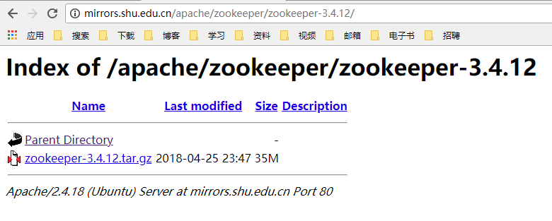
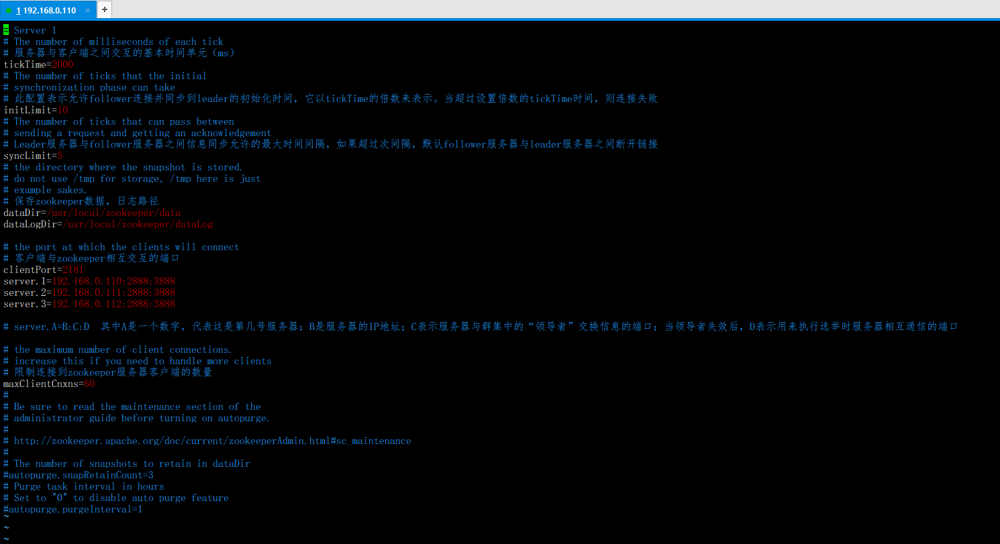

## <center>Zookeeper学习笔记</center>
### 一、[Zookeeper简介](https://www.cnblogs.com/felixzh/p/5869212.html)
1. Zookeeper是什么？
> Zookeeper是一个高效的分布式协调服务，可以提供配置信息管理、命名、分布式同步、集群管理、数据库切换等服务。它不适合用来存储大量信息，可以用来存储一些配置、发布与订阅等少量信息。Hadoop、Storm、消息中间件、RPC服务框架、分布式数据库同步系统，这些都是Zookeeper的应用场景。

2. Zookeeper提供了什么？
    1）文件系统
  2）通知机制

3. Zookeeper文件系统
> 每个子目录项如 NameService 都被称作为znode，和文件系统一样，我们能够自由的增加、删除znode，在一个znode下增加、删除子znode，唯一的不同在于znode是可以存储数据的。

  有四种类型的znode:
  1. PERSISTENT(持久化目录节点)

    > 客户端与zookeeper断开连接后，该节点依旧存在
  2. PERSISTENT_SEQUENTIAL(持久化顺序编号目录节点)

    > 客户端与zookeeper断开连接后，该节点依旧存在，只是Zookeeper给该节点名称进行顺序编号
  3. EPHEMERAL(临时目录节点)

    > 客户端与zookeeper断开连接后，该节点被删除
  4. EPHEMERAL_SEQUENTIAL(临时顺序编号目录节点)

    > 客户端与zookeeper断开连接后，该节点被删除，只是Zookeeper给该节点名称进行顺序编号

4. Zookeeper通知机制
> 客户端注册监听它关心的目录节点，当目录节点发生变化（数据改变、被删除、子目录节点增加删除）时，zookeeper会通知客户端。

5. Zookeeper可以做什么？
> 1.命名服务
> 2.配置管理
> 3.集群管理
> 4.分布式锁
> 5.队列管理

### 二、Zookeeper集群搭建
> 配置Zookeeper节点个数（奇数）为3个，Zookeeper默认对外提供服务的端口号为 2181，Zookeeper集群内部3个节点之间通信默认使用2888:3888
> 192.168.0.110、192.168.0.111、192.168.0.112

1. 先把Java环境配好

2. 下载zookeeper对应的tar包


3. 分别上传tar包到192.168.0.110、192.168.0.111、192.168.0.112
4. 分别在110、111、112三台机子上执行如下命令
  1. 解压、重命名
  ```
  tar -zxvf zookeeper-3.4.12.tar.gz -C /usr/local/
  mv zookeeper-3.4.12 zookeeper
  ```
  2. 配置环境变量
  ```
  vim /etc/profile
  # zookeeper
  export ZOOKEEPER_HOME=/usr/local/zookeeper
  export PATH=$ZOOKEEPER_HOME/bin:$PATH
  ```
  3. 配置zookeeper的配置文件
  ```
  cd zookeeper/conf
  mv zoo_sample.cfg zoo.cfg
  vim zoo.cfg
  ```
  
  4. 根据dataDir进行A的配置【这里三台机子不一样！！！】
  ```
  cd /usr/local/zookeeper
  mkdir data
  touch myid
  echo 1 > myid
  # 比如我配置的三个server，myid里面写的A就是server.A=B:C:D 中的A
  ```
  5. 启动Zookeeper
  ```
  # 方式①使用默认配置文件
  zkServer.sh start
  # 方式②指定启动时使用的配置文件
  zkServer.sh /usr/local/zookeeper/conf/zoo.cfg
  ```
  6. 查看状态
  ```
  zkServer.sh status
  ```
  7. 客户端连接
  ```
  zkCli.sh
  ```
  8. 停止Zookeeper
  ```
  zkServer.sh stop
  ```
